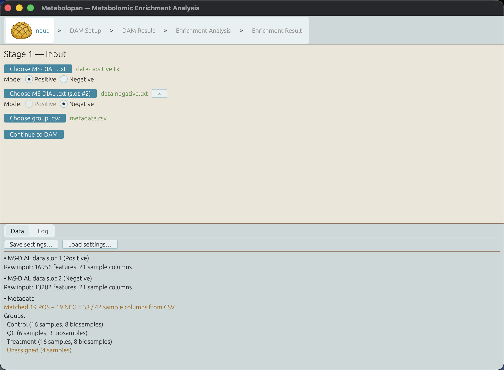
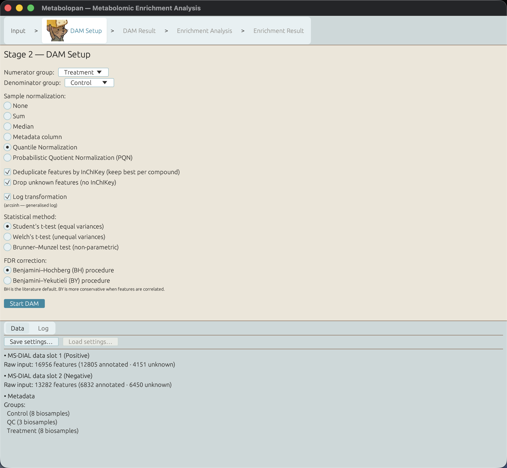
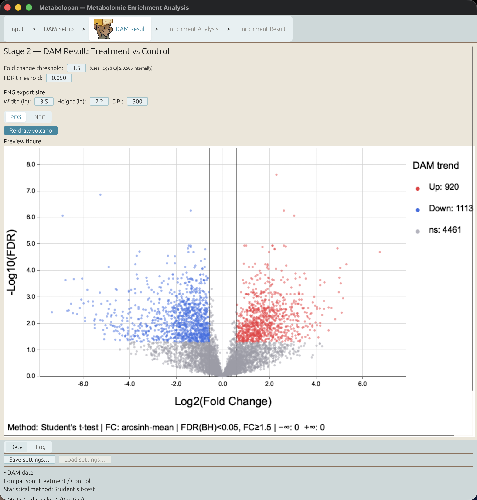
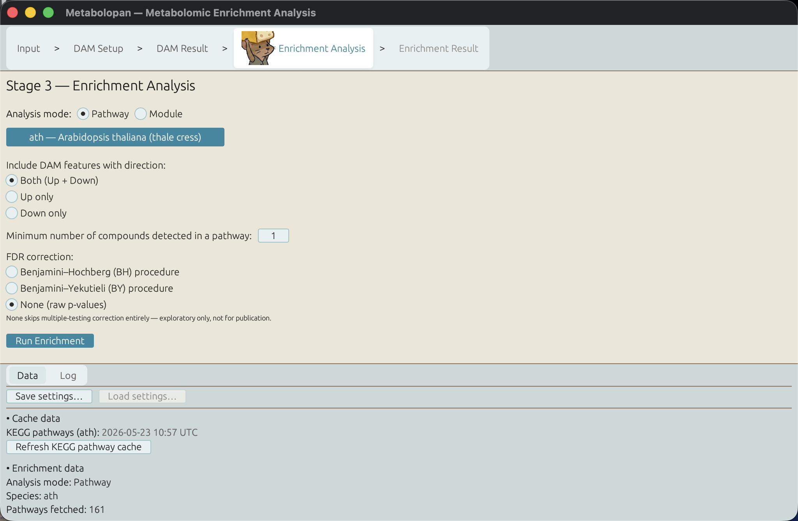
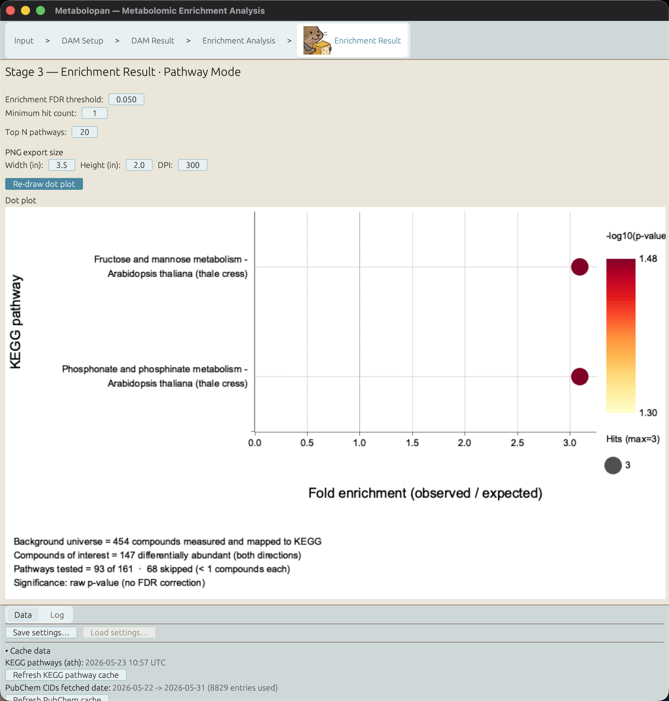

# Metabolopan — Metabolomic Enrichment Analysis

[](https://github.com/SCArcherKuo/metabolopan/actions/workflows/ci.yml)
[](https://github.com/SCArcherKuo/metabolopan/releases/latest)
[](https://github.com/SCArcherKuo/metabolopan/releases)
[](LICENSE)
[](#requirements)
[](https://www.rust-lang.org)

A cross-platform desktop GUI application that takes raw [MS-DIAL](https://systemsomicslab.github.io/compms/msdial/main.html) (v4 or v5) metabolomics output and produces KEGG over-representation analysis (ORA) results end-to-end.

## What it does


The pipeline operates in three stages. All plots (volcano plots and dot plots) are rendered with `plotters` so that the in-window preview and the 600 DPI PNG export share a single rendering engine.

**For the numerical and operational details** — exact statistical methods, default thresholds, deviations from MetaboAnalyst-style defaults, edge-case handling, references — see [USER_MANUAL.md](docs/manual/USER_MANUAL.md).

### Stage 1 — Input

Upload an MS-DIAL `.txt` (wide-format intensity table) and a group-mapping `.csv` (`sample,group` or `sample,biosample,group`). See [**Input format**](#input-format) below for the file content details. Click `Continue to DAM` once both files load cleanly. The bottom **Data** tab summarises every per-slot count and the group breakdown.



### Stage 2 — DAM

Pick numerator and denominator groups; optionally pick a sample normalization method (`None` / `Sum` / `Median` / `Metadata column` / `Quantile` / `PQN`) that's applied column-wise to the intensity matrix before any per-feature work; choose whether the parametric paths apply the `arcsinh` `Log transformation` (checkbox default ON; force-disabled and auto-cleared on Brunner–Munzel because BM is rank-based); run differential-abundance analysis (Student's t-test by default, with Welch's t-test and the non-parametric Brunner–Munzel + Cliff's δ as alternatives); pick the FDR correction (Benjamini–Hochberg by default — matches R `p.adjust` / MetaboAnalyst — with Benjamini–Yekutieli as the more conservative alternative); set fold-change / FDR thresholds, and view / export a volcano plot plus the DAM result table.

| DAM setup | Volcano plot |
| :-: | :-: |
|  |  |

### Stage 3 — Enrichment

Pick the **analysis mode** (Pathway or Module) and the corresponding scope (a KEGG species for pathway mode, or a taxonomy Level + organism Group for module mode). The KEGG fetch runs inline on this screen with a progress strip — no separate fetching window. After the cache is warm, set direction / FDR threshold / FDR method / minimum hit count, and click `Run Enrichment`.

The orchestrator converts the DAM compounds' InChIKeys to PubChem CIDs (PubChem PUG REST), maps PubChem CIDs to KEGG compound IDs (KEGG REST), and runs a hypergeometric ORA against either the species' pathways or the taxonomy Group's modules. The Enrichment Result screen shows the dot plot preview (with a mode-aware **Top N** input alongside Re-run + Refresh buttons) and a PNG / CSV export. The dot plot selects and orders entries on **two different bases**: it keeps the **Top N most significant** entries (lowest FDR), then arranges them top-to-bottom by **fold enrichment descending** (largest on top, matching the clusterProfiler convention of ordering the Y axis by the X-axis metric) — so significance gates which entries appear and effect size only arranges the ones that got in. The plot height auto-fits the number of rows shown and re-fits on every Draw / Re-draw, unless you hand-set the **Height (in)** field.

| Enrichment setup | Dot plot |
| :-: | :-: |
|  |  |


#### Pathway mode vs Module mode

The mode toggle on the Enrichment Analysis setup screen picks which KEGG entry catalogue ORA operates over. Pathway mode is the species-scoped flow — pick one species, get its ~150 pathways, test for enrichment. Module mode replaces the species selector with an organism Group selector (Level 1/2/3 of the [KEGG lineage taxonomy](https://www.kegg.jp/kegg/tables/br08606.html): e.g. `Eukaryotes > Animals > Mammals`) and tests enrichment against the ~573 currently-listed global KEGG modules (IDs sparse in the `M00001`–`M01063` range; KEGG retires some IDs) filtered to those that any organism in the chosen Group fully implements.

The two modes share identical PubChem → KEGG conv → hypergeometric → user-selected-FDR machinery; only the entry catalogue and the scope picker differ. Both modes' selections AND their fetched caches **coexist** for the lifetime of the session — toggling between modes is instant and never re-fetches data you've already pulled.

## Requirements

**To run a prebuilt binary** (most users — no Rust required):

- macOS, Linux, or Windows
- Internet connection (first-time KEGG / PubChem lookups; cached afterwards)

The executable is self-contained — Rust is a compile-time toolchain, so there is no runtime to install. You don't need to clone the repo or install Git LFS; just bring your own MS-DIAL output.

**To build from source** (developers):

- Rust 1.85+ (uses Rust 2024 edition)
- macOS, Linux, or Windows
- [Git LFS](https://git-lfs.com/) (the bundled example MS-DIAL fixtures are stored via LFS)
- Internet connection

## Quick start

### Option A — Download a prebuilt binary (no Rust)

1. Download the executable for your platform from the [Releases](../../releases) page.
2. First launch on macOS / Windows — the app isn't code-signed yet, so the OS warns about an "unidentified developer":
   - **macOS:** right-click the app → **Open** → **Open** (or run `xattr -d com.apple.quarantine /path/to/metabolopan` once).
   - **Windows:** click **More info** → **Run anyway** on the SmartScreen prompt.
   - **Linux:** `chmod +x metabolopan` and run it (needs a desktop session with X11/Wayland + OpenGL).
3. The app opens a native window and guides you through the three stages — see [**What it does**](#what-it-does) above for the full walkthrough and screenshots.

**Verify your download (optional).** Every release artifact — and the attached `SHA256SUMS` — carries [Sigstore](https://www.sigstore.dev) build provenance, so you can confirm a file was built by this repository's CI and was not tampered with:

```bash
# provenance (needs the GitHub CLI):
gh attestation verify metabolopan-<version>-<platform>.tar.gz --repo SCArcherKuo/metabolopan
# integrity (run in the folder holding the downloaded archives + SHA256SUMS):
sha256sum -c SHA256SUMS
```

### Option B — Build from source

```bash
# The example MS-DIAL fixtures are stored in Git LFS — install it first so the
# clone pulls real files (macOS: brew install git-lfs · Debian: apt install git-lfs).
git lfs install
git clone <repository-url>
cd metabolopan
cargo run --release
```

> Already cloned without LFS? Run `git lfs install && git lfs pull` to materialize
> the `data/single-mode/` and `data/double-mode/` `.txt` fixtures from pointer files.

## Input format

### Single-mode vs dual-mode

metabolopan runs in one of two input modes, chosen implicitly by how many MS-DIAL `.txt` files you load:

- **Single-mode** — one MS-DIAL `.txt` + one group-mapping `.csv`. The everyday case.
- **Dual-mode** — two MS-DIAL `.txt` files (one **positive**, one **negative** ionization) + one group-mapping `.csv`. The `.csv` must include a `biosample` column so the tool can pair each sample's positive- and negative-mode injections as the same biological replicate.

Both modes use the same file formats described below; dual-mode just adds the second `.txt` and the required `biosample` column.

#### Example data

Want sample data to try first? A source checkout ships reference fixtures — `data/single-mode/MS-DIAL-output-example.txt` + `metadata-example.csv`, plus the dual-mode (positive + negative ionization) set under `data/double-mode/`.

### MS-DIAL `.txt`

metabolopan reads the Alignment Result export from **both MS-DIAL 4 and MS-DIAL 5**.

Columns are located by *name*, not position, so the two versions' different column ordering and scoring-column layout are both handled — MS-DIAL 5 splits the single `Dot product` column into `Simple dot product` + `Weighted dot product` and adds `Matched peaks count` / `percentage`, but metabolopan reads only the annotation and quality columns common to both versions.

Tab-delimited wide table as exported by MS-DIAL's Alignment Result. The first four rows are metadata (`Class`, `File type`, `Injection order`, `Batch ID`); the fifth row is the column header. Any column whose `File type` value is non-empty, not `"NA"`, and not the literal label `"File type"` is treated as a real sample injection — this includes `Sample` AND `Blank` columns. Only MS-DIAL's per-group `Average` / `Stdev` aggregations (which carry `NA` as their File type) are excluded; the excluded set is surfaced in the input summary.

In addition to the seven standard annotation columns (`Alignment ID`, `Metabolite name`, `INCHIKEY`, `Average Rt(min)`, `Average Mz`, `Formula`, `SMILES`), the parser also reads six *quality* columns used by Stage 2's optional InChIKey deduplication step: `Adduct type`, `Fill %`, `MS/MS matched`, `Isotope tracking weight number`, `Total score`, and `S/N average`. These are treated as **optional** — older MS-DIAL exports that lack any of them parse with a per-column `WARN` log; the dedup cascade then has less to rank with but still works. Deduplication is **on by default** with an opt-out checkbox on the Stage 2 setup screen (see [`USER_MANUAL.md`](docs/manual/USER_MANUAL.md) for the cascade rules).

### Group mapping `.csv`

The CSV must contain a column named `sample` and a column named `group`; **their position and order don't matter** (`sample,group`, `group,sample`, and `dry_weight,sample,group` all work).

An optional column literally named `biosample` — in any position — records a per-sample biological-replicate label used for dual-mode provenance and the Data tab's biosample counts; it loads but is never offered for normalization.

Column names are matched exactly (case-sensitive); a missing `sample`/`group` column, or a duplicated `sample`/`group`/`biosample` column, is rejected with a clear error. **Any further columns are treated as optional metadata.** Columns whose non-empty cells all parse as numbers (e.g. `dry_weight`, `dilution`, `total_protein`) are exposed to Stage 2's "Metadata column" normalization. Other non-numeric columns load successfully but are **silently excluded from the normalization dropdown**; a per-column WARN line in the in-app log pane names what was skipped, so typos in an otherwise-numeric column stay visible (fix the typo, reload — the column reappears).

```csv
sample,biosample,group,dry_weight,dilution
S1-1,TRT-01,Treatment,12.4,1.0
S1-2,TRT-02,Treatment,11.8,1.0
S2-1,CTR-01,Control,12.1,2.0
S2-2,CTR-02,Control,11.5,2.0
```

In the example above, `biosample` is kept in the CSV for provenance but never appears in the Stage 2 dropdown; only `dry_weight` and `dilution` do.

Groups can be any non-empty string (including numeric labels like `1`, `9`). Samples not listed in the CSV but present in the MS-DIAL `.txt` are flagged as `Unassigned`. Numeric metadata cells may be empty (parsed as `None`; the sample is then dropped from Metadata-column normalization). Negative or zero metadata values parse successfully but error at Stage 2 if that column is chosen for normalization.

## Project layout

```
src/                              Rust source
  app.rs                          Top-level App + AppState state machine + AnalysisMode/AnalysisPayload
  data/                           MS-DIAL parser (incl. 6 quality columns for dedup) + group mapping (incl. numeric metadata columns)
  dam/                            Stage 2 statistics (Student / Welch / BM / FDR / classify_trend) + CSV exporters (incl. dedup audit)
  dedup/                          Stage 2 InChIKey deduplication — pure-function cascade (MS/MS → Total score → adduct class → Fill% → S/N → alignment_id)
  normalize/                      Stage 2 sample normalization (None / Sum / Median / Metadata / Quantile / PQN)
  kegg/                           KEGG REST client + caches + organism-group index
    cache.rs                        per-species, modules, CID→cpd, organism-groups caches + locks
    client.rs                       REST client (list/get/conv + module endpoints) + parsers
    conv.rs                         CID→cpd resolver
    groups.rs                       organism lineage → Group precompute
  pubchem/                        PubChem PUG REST client + InChIKey→CID cache
  enrichment/                     Stage 3 hypergeometric ORA + CSV export
  stage3/                         Stage 3 orchestrator (PubChem → KEGG conv → ORA) + AnalysisTarget
  plot/                           plotters-based volcano + dot plot renderers
  diagnostics/                    per-session file log sink + bug-report bundle assembly + AppState snapshot + home-dir redaction
  ui/                             per-stage egui screens
    initializing.rs                 startup splash
    organism_group_selector.rs      module-mode Level + Group picker (rendered on Stage 3 setup)
    species_selector.rs             pathway-mode species picker (rendered on Stage 3 setup)
    stage1_input.rs                 file pickers only (no mode toggle, no KEGG selector)
    stage2_setup.rs / stage2_threshold.rs / stage2_running.rs
    stage3_setup.rs                 mode toggle + selector + inline KEGG fetch progress
    stage3_running.rs / stage3_result.rs
data/                             Example input files
  single-mode/                    MS-DIAL .txt + metadata .csv (canonical single-mode fixture)
  double-mode/                    POS + NEG MS-DIAL .txt + 3-column metadata .csv (dual-mode fixture)
tests/                            Integration tests + fixtures
docs/manual/                      User manual (EN + zh-TW) — methodology, defaults, references
README.md                         This file
```

## Development workflow

See [CONTRIBUTING.md](CONTRIBUTING.md) for dev setup, code style, and how to propose changes.

## License

Apache License 2.0. See [LICENSE](LICENSE).
