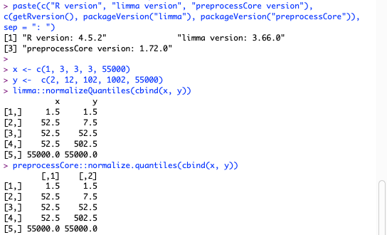

# User Manual

Software version: metabolopan v1.2.0

Update date: 2026-06-05

This manual documents what the software does numerically — algorithms, default thresholds, deviations from common alternatives — so you can defend any number it produces in a paper or report.
Read this once before publishing results that depend on the software.

The pipeline operates in three stages.

## How to read this manual

This manual is written on **two tracks** so it works whether you just want to run an analysis or you need to defend every number in a paper.

- **Plain-language leads** open each section in 2–4 sentences: what the step does, how you click through it, what you pick, and what you get back. Skim these and you can run the whole pipeline.
- **Deeper technical blocks** (formulas, edge cases, and anything marked `> **For developers:**`) sit underneath. You can skip them on a first read and come back when a reviewer asks "why this number?".

**Formatting legend** (applied consistently throughout):

- **Bold** = a UI control you click or set — a button, radio, checkbox, or field (for example **Start DAM**, the **DAM method** radio, the **Log transformation** checkbox, **Continue to DAM**).
- `monospace` = literal text seen on disk or in a file — file names, CSV headers, settings keys, log lines, formulas, and values (for example `0.05`).
- `> **For developers:**` callouts hold internal implementation detail that a non-coder never needs. Skip them freely.

Other callouts you will see: `> **Note:**` (clarifications, or where this software differs from standard tools), `> **⚠ Warning:**` (data-entry errors and fail-fast conditions), and `> **Example:**` (worked numbers and intuition).

**Three reading paths:**

- **(a) Just running an analysis.** Read the leads of [Stage 1 — Input parsing](#stage-1--input-parsing), [Stage 2 — Normalization, Deduplication & DAM](#stage-2--normalization-deduplication--dam), [Stage 3 — Enrichment (over-representation analysis)](#stage-3--enrichment-over-representation-analysis), and the [Worked example](#worked-example).
- **(b) Defending numbers in a paper.** Read the method subsections ([DAM](#differentially-accumulated-metabolites-dam) test methods 3a–3c), [Multiple-testing correction (FDR)](#4-multiple-testing-correction), [Missing values vs true zeros](#missing-values-nan-vs-true-zeros-00), and [Key references](#key-references).
- **(c) Reproducibility / scripting.** Read [Saving and loading session settings (reproducibility)](#saving-and-loading-session-settings-reproducibility) and [Caches and provenance](#caches-and-provenance).

## Pipeline at a glance

**Who this is for:** wet-lab metabolomics researchers — no coding is needed to run it.

The pipeline operates in three stages. Each stage takes an input, performs one key operation, and hands the next stage a result:

| Stage | Input | Key operation | Output |
|-------|-------|---------------|--------|
| **Stage 1 — Input** | MS-DIAL `.txt` + group-mapping `.csv` | Parse and align, keeping *missing* cells distinct from *true zeros* | A parsed table |
| **Stage 2 — Normalize → deduplicate → test** | The parsed table | Optional sample normalization, then InChIKey deduplication, then a per-feature statistical test | **DAM features + a volcano plot** |
| **Stage 3 — Enrichment** | The DAM features | InChIKey → PubChem CID → KEGG compound, then hypergeometric over-representation | **A dot plot** |

> **Note:** Single-mode runs one MS-DIAL `.txt` + one group `.csv`; dual-mode runs two MS-DIAL `.txt` files (positive + negative ionization) + one group `.csv` with a `biosample` column. The mode you pick is set at Stage 1 and threads through every later stage.

## Key terms & symbols

**Symbols**

| Symbol | Plain-language meaning | Stage |
|--------|------------------------|-------|
| N | Universe size — total unique KEGG compounds the analysis could draw from | 3 |
| K | Foreground size — the unique drawn (DAM) KEGG compounds | 3 |
| m | Number of features the FDR correction is applied over (the test family size) | 2 |
| m_p | The per-pathway ORA test family size | 3 |
| k_p | Drawn compounds that fall in a given pathway | 3 |
| M_m | Compounds in a given module's catalog | 3 |
| k_m | Drawn compounds that fall in a given module | 3 |
| M (median factor) | The median of the per-sample normalization factors — the target magnitude every column is rescaled toward | 2 |
| f_j | The per-sample normalization factor for sample column *j* (column sum, median, or metadata value) | 2 |
| δ | Cliff's δ effect size — how separated two groups are, from `−1` to `+1` | 2 |
| FDR | False discovery rate — the corrected significance value (q-value) per feature | 2 |
| FC | Fold change between the numerator and denominator groups | 2 |
| log2(FC) | The base-2 logarithm of fold change — the volcano plot's X axis | 2 |
| q-value | An individual feature's FDR-corrected p-value | 2 |
| c(m) | The harmonic factor `∑_{i=1}^{m} 1/i` that BY multiplies onto BH's q-values | 2 |
| df | Degrees of freedom of the t / Brunner–Munzel distribution | 2 |

**Terms**

| Term | One-sentence meaning |
|------|----------------------|
| DAM | Differentially Accumulated Metabolites — features that differ significantly between the two chosen groups. |
| ORA | Over-representation analysis — testing whether your drawn compounds land in a pathway/module more than chance. |
| InChIKey | A hashed chemical-structure identifier used to recognize when two MS-DIAL rows are the same compound. |
| KEGG pathway | A per-species KEGG catalog of reactions grouping related compounds. |
| KEGG module | A per-Group KEGG catalog of a tighter functional unit of compounds. |
| adduct | A specific ionized form of a neutral molecule (e.g. `[M+H]+`, `[M+Na]+`). |
| isotope peak | A natural-abundance M+1 / M+2 satellite of a compound's monoisotopic (M0) peak. |
| hypergeometric test | The statistic behind ORA — the chance of drawing this many pathway compounds without replacement. |
| universe / foreground | The full candidate compound set (universe, `N`) vs the drawn subset under test (foreground, `K`). |
| volcano plot | The Stage 2 scatter of `log2(FC)` against `−log10(p_adjusted)`. |
| dot plot | The Stage 3 enrichment result chart. |
| fold enrichment | How much more represented a pathway is than chance in ORA. |
| PQN | Probabilistic Quotient Normalization — an NMR-style correction for sample dilution. |
| arcsinh | The inverse hyperbolic sine, a variance-stabilizing transform that behaves like a log for large values and linearly near zero. |
| measurable metabolome | The set of compounds the assay could in principle detect — the basis for the enrichment universe. |
| biosample | A biological-sample label that pairs a positive-mode and negative-mode injection in dual-mode. |

> **Note: Core concept — missing values vs true zeros.** A blank or `"NA"` cell becomes an internal "missing" marker (`f64::NAN`) that downstream statistics **SKIP**; a written `0` is a real zero that **participates** in the math. See the full [Missing values vs true zeros](#missing-values-nan-vs-true-zeros-00) section for details.

- [User Manual](#user-manual)
  - [How to read this manual](#how-to-read-this-manual)
  - [Pipeline at a glance](#pipeline-at-a-glance)
  - [Key terms & symbols](#key-terms--symbols)
  - [Stage 1 — Input parsing](#stage-1--input-parsing)
    - [MS-DIAL `.txt`](#ms-dial-txt)
    - [Group mapping `.csv`](#group-mapping-csv)
    - [Stage 1 → Stage 2 gate](#stage-1--stage-2-gate)
  - [Stage 2 — Normalization, Deduplication & DAM](#stage-2--normalization-deduplication--dam)
    - [Differentially Accumulated Metabolites (DAM)](#differentially-accumulated-metabolites-dam)
      - [1. Unknown-feature filter (default ON)](#1-unknown-feature-filter-default-on)
      - [2. Per-feature pre-filter](#2-per-feature-pre-filter)
      - [3a. Method: Student's t-test (equal variances) \[parametric, **default**\]](#3a-method-students-t-test-equal-variances-parametric-default)
      - [3b. Method: Welch's t-test (unequal variances) \[alternative parametric\]](#3b-method-welchs-t-test-unequal-variances-alternative-parametric)
      - [3c. Method: Brunner–Munzel test + Cliff's δ \[non-parametric\]](#3c-method-brunnermunzel-test--cliffs-δ-non-parametric)
      - [4. Multiple-testing correction](#4-multiple-testing-correction)
      - [5. Trend classification](#5-trend-classification)
      - [6. Volcano plot](#6-volcano-plot)
      - [7. Exporting the figure as PNG](#7-exporting-the-figure-as-png)
      - [DAM caveats worth knowing](#dam-caveats-worth-knowing)
    - [Deduplication by InChIKey](#deduplication-by-inchikey)
      - [Cascade decision table](#cascade-decision-table)
      - [Audit CSV](#audit-csv)
      - [Opt-out](#opt-out)
    - [Sample normalization](#sample-normalization)
      - [Why Sum / Median / Metadata rescale to the median factor (rather than divide to a constant)](#why-sum--median--metadata-rescale-to-the-median-factor-rather-than-divide-to-a-constant)
      - [Lifecycle](#lifecycle)
      - [Errors at startup](#errors-at-startup)
      - [Caveats worth knowing](#caveats-worth-knowing)
  - [Stage 3 — Enrichment (over-representation analysis)](#stage-3--enrichment-over-representation-analysis)
    - [Enrichment Analysis setup screen](#enrichment-analysis-setup-screen)
    - [Enrichment Analysis result screen](#enrichment-analysis-result-screen)
    - [Pathway mode](#pathway-mode)
    - [Module mode](#module-mode)
    - [Starting a new analysis round](#starting-a-new-analysis-round)
  - [Advanced topics & reference](#advanced-topics--reference)
  - [Missing values (`NaN`) vs true zeros (`0.0`)](#missing-values-nan-vs-true-zeros-00)
  - [Dual-mode (positive + negative ionization) input](#dual-mode-positive--negative-ionization-input)
    - [When to use dual-mode](#when-to-use-dual-mode)
    - [Preparing inputs](#preparing-inputs)
    - [Unbalanced or missing-mode samples](#unbalanced-or-missing-mode-samples)
    - [Stage 1 UI](#stage-1-ui)
    - [Stage 2 (shared setup, per-mode DAM)](#stage-2-shared-setup-per-mode-dam)
    - [Stage 3 — dual-mode N and K math](#stage-3--dual-mode-n-and-k-math)
    - [Worked example](#worked-example)
  - [Caches and provenance](#caches-and-provenance)
  - [Saving and loading session settings (reproducibility)](#saving-and-loading-session-settings-reproducibility)
    - [What's in the file](#whats-in-the-file)
    - [The full file, field by field](#the-full-file-field-by-field)
    - [When is each button available](#when-is-each-button-available)
    - [Loading workflow](#loading-workflow)
    - [What if I load settings before uploading metadata?](#what-if-i-load-settings-before-uploading-metadata)
    - [Hand-editing the JSON](#hand-editing-the-json)
  - [Reporting bugs](#reporting-bugs)
  - [Key references](#key-references)

---

## Stage 1 — Input parsing

**In plain terms:** Stage 1 is where you load your data. You drag in your MS-DIAL export(s) and a small group-mapping spreadsheet, and metabolopan parses them into one working table — carefully keeping *missing* cells distinct from *real zeros*. When both files parse cleanly and your groups are valid, the **Continue to DAM** button lights up and you move to Stage 2.

metabolopan takes input in one of two modes, chosen by how many MS-DIAL `.txt` files you load.
**Single-mode** is one MS-DIAL `.txt` + one group-mapping `.csv`; **dual-mode** is two MS-DIAL `.txt` files (one positive, one negative ionization) + one group-mapping `.csv` that includes a `biosample` column.
The file formats below apply to both modes; the dual-mode-specific mechanics (biosample pairing, group parity checks, per-mode DAM) are covered in [Dual-mode (positive + negative ionization) input](#dual-mode-positive--negative-ionization-input) below.

### MS-DIAL `.txt`

- First 4 rows are MS-DIAL metadata (`Class`, `File type`, `Injection order`, `Batch ID`); the 5th row is the column header.
  A column is treated as a real sample injection — and kept in `sample_cols` — when its `File type` value is non-empty AND not `"NA"` AND not the literal row label `"File type"`.
  This **includes** `Sample` and `Blank` (process blanks); it excludes only MS-DIAL's per-group `Average` / `Stdev` aggregation columns (labeled `NA`).
- **Version compatibility.** Both MS-DIAL 4 and MS-DIAL 5 Alignment exports are supported.
  Column lookup is by name, so MS-DIAL 5's reordered/renamed scoring columns (it splits `Dot product` into `Simple` / `Weighted dot product`) parse identically; metabolopan uses only the columns shared by both versions.
- **Missing values.** Empty / whitespace / `"null"` / `"NA"` / unparseable intensity cells become `f64::NAN` — an internal "missing" marker.
  Explicit `"0"` stays `0.0`.
  This prevents downstream statistics from confusing missing measurements with true zeros.
  See [Missing values vs true zeros](#missing-values-nan-vs-true-zeros-00) for details.

### Group mapping `.csv`

- The CSV must contain a column named `sample` and a column named `group`, in **any position/order**.
  An optional `biosample` column (any position; required for dual-mode — see [Dual-mode input](#dual-mode-positive--negative-ionization-input) below) is recognized by name.
  Any further columns are parsed as optional metadata.
  Column names are matched exactly (case-sensitive); a missing `sample`/`group` column, a duplicated `sample`/`group`/`biosample` column, empty `group` cells, or duplicate `sample` names are each rejected with a descriptive error.
  Metadata columns are classified per-column at load time: a column whose non-empty cells all parse as numbers is exposed to Stage 2's **Metadata column** normalization radio (e.g.
  `dry_weight`, `dilution`, `total_protein`); a column with any non-empty non-numeric cell (e.g. a `biosample` label like `CTR-01`) is silently dropped from that radio and a WARN line in the in-app log pane names which column was skipped and how many cells failed to parse.
  Empty metadata cells parse to `None`.
  Samples that appear in the MS-DIAL `.txt` but not in the CSV are flagged `Unassigned`; rows in the CSV that name samples missing from the `.txt` are logged as warnings and ignored, and listed in a red banner on the Input screen.
  **Unassigned samples are visible on Stage 1 only** — the input-summary panel shows them with a yellow `Unassigned (N samples)` row so you know they exist, but they are dropped from the working matrix when you click **Start DAM** on the Stage 2 setup screen.
  No normalization, deduplication, DAM statistic, or downstream export ever sees them.
  To include a sample in analysis, add it to the metadata CSV with a real group label; to exclude a sample entirely (so it doesn't even show on Stage 1), remove its column from the MS-DIAL `.txt` File type row (set the entry to `NA`).

### Stage 1 → Stage 2 gate

The **Continue to DAM** button stays disabled until:

- both files parse successfully;
- the slot-#1 ionization-mode radio is set;
- ≥ 2 distinct non-`Unassigned` groups exist;
- every assignable group has ≥ 2 samples (required for downstream statistics).

---

## Stage 2 — Normalization, Deduplication & DAM

**In plain terms:** All of the following are options on the single Stage 2 setup screen; together they configure one DAM run.
Below they are presented in the order that matters most — first the core statistical test (DAM) that decides which metabolites differ, then the deduplication that cleans up duplicate compound rows, then the optional sample normalization that corrects technical loading before any of it.

### Differentially Accumulated Metabolites (DAM)

**In plain terms:** DAM is the heart of Stage 2 — it tests every metabolite, one at a time, between the two groups you chose (numerator vs denominator) and tells you which ones really differ. You pick a statistical method (**Student**, **Welch**, or **Brunner–Munzel**), pick an FDR correction (**BH** or **BY**), click **Start DAM**, and get a volcano plot plus an exportable table of up / down / not-significant features.

Each feature is tested independently between the user-chosen numerator and denominator groups.
Three statistical methods are offered; all follow the same overall flow.

**Which test should I pick?** ("Spread" / variance = how scattered a group's values are.)

| Method | Pick it when… | Nature |
|--------|---------------|--------|
| **Student's t-test** *(default)* | the two groups are similarly spread and similarly sized | parametric |
| **Welch's t-test** | one group is visibly more scattered than the other | parametric |
| **Brunner–Munzel + Cliff's δ** | data is skewed or presence/absence even after `arcsinh` | non-parametric |

#### 1. Unknown-feature filter (default ON)

Features whose `InChIKey` is `null` (MS-DIAL "Unknown" annotation) are dropped before any statistical work, so the FDR correction's `m` does not include metabolites that cannot enter Stage 3 ORA anyway.
The user can untick a **Drop unknown features (no InChIKey)** checkbox in Stage 2 setup if they specifically want statistical results on unannotated features (e.g. to flag candidates for follow-up identification).

#### 2. Per-feature pre-filter

For every remaining feature, NaN values across the combined `numerator ∪ denominator` columns are dropped, then we require, in order: (i) the numerator group has ≥ 2 non-NaN values, (ii) the denominator group has ≥ 2 non-NaN values, (iii) the combined `nunique > 1`, and (iv) the combined `IQR > 0`.
Features failing any check are removed from the result and counted in a `skipped` tally visible in the UI.

#### 3a. Method: Student's t-test (equal variances) [parametric, **default**]

Classical (homoscedastic) form.
Best when sample sizes per group are similar and the two groups have roughly comparable spread — under those assumptions it has slightly more power than Welch.
**Default for new sessions**: paired with the **Log transformation** (arcsinh) step (also ON by default), it is the project's standard starting point.
Switch to Welch if you suspect unequal variances, or to Brunner–Munzel when the distributions are skewed enough that the transform is not enough.

- Optional pre-test transform shared with Welch: when the Stage 2 setup **Log transformation** checkbox is checked (default ON; `SessionSettings.log_transform = true`), `arcsinh(x)` is applied to every non-NaN cell as the variance-stabilization step (asinh handles zeros / negatives where log10 would NaN them).
  When unchecked, this step is skipped and the raw working-matrix values flow straight into the t-test.
- Pooled variance `sp² = ((na − 1)·va + (nb − 1)·vb) / (na + nb − 2)`, fixed degrees of freedom `df = na + nb − 2`, two-tailed p via the Student-*t* CDF.
- **Fold change (FC) scale depends on `log_transform`.** Reason: under `log_transform=true`, the *t* statistic is computed on the arcsinh-transformed scale, but arcsinh is concave for positive values, so by Jensen's inequality the *raw* mean ratio of two heavy-tailed groups can disagree in **sign** with the arcsinh-mean difference that the *t*-test actually evaluates.
  Reporting the raw mean ratio alongside an arcsinh-scale *p* value silently misclassifies outlier-driven features (e.g. `num=[0.1]×9 + [100]` vs `den=[5]×10` gives raw FC ≈ 2.02 ⇒ "Up", but Welch *t* ≈ −3.25, *p* ≈ 0.01 ⇒ "Down").
  The parametric arm matches scales:
    - `log_transform=false` (raw scale): `FC = mean(numerator) / mean(denominator)`, `log2(FC) = log2(FC)`.
    - `log_transform=true` (arcsinh scale): `log2(FC) = (mean(arcsinh(num)) − mean(arcsinh(den))) / ln(2)`, and `FC = 2^log2(FC)`.
      Sign of `log2(FC)` is **guaranteed** to agree with the *t*-statistic sign on the same data.
      For large *x* arcsinh(x) ≈ ln(2x), so `log2(FC)` asymptotes to `log2(GM(num) / GM(den))` — the classical log-fold-change of limma / DESeq2.
      For small *x* (close to 0) arcsinh(x) ≈ x, so `log2(FC)` degrades to a scaled arithmetic mean difference rather than a true ratio.
      This is a documented consequence of variance-stabilization; the equivalent log-FC interpretation only holds in the large-*x* asymptote where arcsinh aligns with ln.
      CSV exports surface the active basis via the `fc_basis` column (`mean` / `median` / `arcsinh-mean`) so downstream consumers can identify which scale a number is on without rerunning the pipeline.

#### 3b. Method: Welch's t-test (unequal variances) [alternative parametric]

Same parametric family as Student, but does not assume equal variances.
Use this when group spreads visibly differ, or as a safer default when you are unsure.

- Same optional pre-test transform as Student (`arcsinh` only, gated by the Stage 2 **Log transformation** checkbox; default ON).
- Welch's t statistic is computed from the (optionally arcsinh-transformed) values using NaN-aware means and variances, with Welch–Satterthwaite degrees of freedom, then converted to a two-tailed p via the Student-*t* CDF.
- **Fold change scale matches the test scale** — same rule as Student above.
  With `log_transform=true`, `FC` is on the arcsinh scale, so its sign always agrees with the Welch *t* sign.
  With `log_transform=false`, `FC` is the classical raw mean ratio.

> **⚠ Warning: Welch / Student edge case — zero variance in one group.** When every replicate in one group has the same value (e.g. the feature is below the limit of detection in every sample of one condition and gets imputed to a constant), the Welch–Satterthwaite degrees of freedom collapse to `n − 1` of the OTHER group.
> For `n = 2` this gives `df = 1`, which makes the *t* distribution extremely wide and the p-value very conservative — even when the two groups are visibly well-separated.
> This is the standard mathematical behavior (matches R's `t.test(var.equal=FALSE)` and SciPy's `ttest_ind(equal_var=False)` exactly), but for metabolomics the affected features often correspond to genuine "presence-in-one-condition, absence-in-the-other" signals you may want to keep.

`run_dam` emits a single INFO log per run reporting the count of features that triggered this path (look for `zero_variance_features=N` in your session log at `<data_dir>/metabolopan/logs/session_*.log`, where `<data_dir>` is `dirs::data_dir()` — macOS `~/Library/Application Support`, Linux `~/.local/share`, Windows `%APPDATA%`); when N > 0, consider re-running with the Brunner–Munzel method, which is rank-based and handles this edge case differently.

> **For developers:** The diagnostic counter uses a relative tolerance — variance below
> `(max(|mean|, 1))² × 1e−20` is flagged — so features whose group is constant up to
> floating-point noise (e.g. arithmetic on bit-equal pre-norm inputs at high intensity scale where `var ≈ ε² × c²` is non-zero but the df pathology kicks in the same way) also contribute to the count.
> The per-method `var == 0.0` guard inside the t-test functions themselves is unchanged — only this diagnostic counter was loosened.

#### 3c. Method: Brunner–Munzel test + Cliff's δ [non-parametric]

Appropriate when the intensity distributions are skewed or unequal across groups and the variance-stabilizing transform is not enough.
Metabolomics data is often poorly described by Gaussian assumptions (highly skewed log-distributions, frequent presence/absence patterns, batch artifacts), so in those cases Brunner–Munzel + Cliff's δ can deliver more honest p-values across the kind of spreads the workflow sees.
Select it via the Stage 2 setup radio when the default Student's t-test (even after `arcsinh`) is a poor fit — e.g. heavily skewed or presence/absence-dominated features, or when matching a previously published non-parametric analysis.

- The Brunner–Munzel statistic is computed with mid-ranks across `numerator ∪ denominator`, combined with Welch–Satterthwaite-like degrees of freedom, then converted to a two-tailed p-value via the Student-*t* distribution.
  Behavior matches SciPy's `brunnermunzel(distribution='t')` and R's `lawstat::brunner.munzel.test` — the W denominator inside `sqrt` is `nx·Sx + ny·Sy`.
- Cliff's δ effect size: `(gt − lt) / (n · m)` where `gt` and `lt` are the strict-greater and
  strict-less pair counts. Range `−1` to `+1`; |δ| ≥ 0.33 is the conventional "medium effect"
  threshold used here.

  > **Example:** Cliff's δ is how often a random replicate from one group out-measures a random replicate from the other. `δ = 0` means the groups fully overlap; `|δ| = 1` means complete separation; `|δ| ≥ 0.33` means the two disagree about two-thirds of the time (Cliff 1993).

- Fold change uses group **medians**: `FC = median(numerator) / median(denominator)` and `log2(FC) = log2(FC)`.
  Medians are robust against outliers, matching the rank-based-test philosophy.

#### 4. Multiple-testing correction

**In plain terms:** When you test thousands of metabolites at once, some will look "significant" by pure luck — test 5,000 features at p < 0.05 and you'd expect ~250 false hits even if nothing were real. FDR correction reins this in by inflating each raw p-value into a q-value that accounts for the whole family of tests. Think of the **BH** vs **BY** radio as a sensitivity/safety dial: BH is the standard, more-discoveries setting; BY is the stricter, safer-when-features-correlate setting.

Each Stage 2 run applies a user-selected false discovery rate (FDR) correction to the per-feature p-values, regardless of which statistical method produced them.
The Stage 2 setup screen exposes a radio with two options:

- **Benjamini–Hochberg (BH) procedure** — the default.
  BH assumes independence or positive regression dependence between tests (i.e. it assumes the tests don't conspire), and yields more discoveries.
- **Benjamini–Yekutieli (BY) procedure** — opt-in, stricter.
  Multiplies BH's q-values by the exact harmonic factor $c(m) = \sum_{i=1}^{m} \frac{1}{i}$ (≈ ln(m) + γ for large m, so BY is roughly 9× more conservative than BH at m = 5,000 — that ~9× is the price you pay).
  BY controls FDR under arbitrary positive dependence, so it is the safer choice when many features are biologically correlated (e.g. metabolites sharing pathway membership).

NaN p-values pass through corrected as NaN under either method.
The chosen method is reported on the volcano annotation strip (e.g.
`FDR(BH)<0.05`) and written as a leading `# FDR: BH` / `# FDR: BY` comment line on every DAM CSV export, so screenshots and downloads are self-documenting.
References: Benjamini & Hochberg (1995); Benjamini & Yekutieli (2001).

#### 5. Trend classification

It's recomputed live as the user adjusts thresholds — never stored in the result.
Default thresholds: `FC = 2.0` (equivalently |log2(FC)| > 1.0), `FDR = 0.05`, `|δ| ≥ 0.33` (BM only).

- Student / Welch (both parametric, no effect size): `Up` iff `FDR < threshold` AND `log2(FC) > log2(fc_threshold)`; `Down` iff `FDR < threshold` AND `log2(FC) < −log2(fc_threshold)`.
  The δ threshold is ignored for the parametric tests.
- Brunner–Munzel: the parametric rule **AND** `|δ| ≥ delta_threshold`. Features with `δ = None`
  (BM was unable to compute the effect size because one group had fewer than 2 non-NaN values) are classified `NotSignificant`.

#### 6. Volcano plot

X axis = `log2(FC)`, Y axis = `−log10(p_adjusted)`.
**What the X axis represents depends on the active method and the `Log transformation` toggle** — mean ratio for Welch / Student with `log_transform=false`, arcsinh-mean difference (in log2 units) for Welch / Student with `log_transform=true`, median ratio for Brunner–Munzel.
See section 3 above; the active basis is recorded on each `DamFeature` as `fc_basis` (`mean` / `arcsinh-mean` / `median`).
Three colors follow the trend classification (red / blue / gray, transparency α ≈ 0.5).
Threshold lines are solid black: the horizontal line at `−log10(FDR)`, the vertical lines at `±log2(FC)`.
Features whose `log2(FC)` is `±∞` (one group's mean or median is exactly 0) are docked at the X-axis edges `±(xabs_max + 0.5)` with a small jitter so they stay visible.
Symmetric saturation on the Y axis: features whose BH/BY q-value underflows to exactly `0.0` (very large `|t|` / very small raw p, common for well-separated groups) are docked **just below** the Y-axis top (`y_max`) with a per-point downward jitter of up to `0.08` in `−log10(q)` units (scale-matched to the X-axis ±0.04 jitter convention) so multiple saturated features don't pile at a single pixel.
The underlying `neg_log10_p_adjusted` value is still `f64::INFINITY`, recorded as such in the CSV export — only the on-screen position is jittered.
The Y axis is otherwise clipped at `finite_max + 1` for display only; underlying numeric values are preserved in the CSV export.
`NaN` `neg_log10_p_adjusted` is reserved for genuine "p couldn't be computed" cases (BM perfectly stratified groups; parametric test with `n < 2` after NaN-drop) — those points are dropped from the plot but still listed in the CSV.
A single annotation strip below the X-axis label summarizes method, the active FC basis (`FC: mean` / `FC: median` / `FC: arcsinh-mean`), active thresholds, and ±∞ counts — e.g. `Method: Brunner-Munzel | FC: median | FDR(BH)<0.05, FC≥2, |δ|≥0.33 | −∞: 12  +∞: 8`.

**BM dot size encodes Cliff's δ magnitude.** On Brunner–Munzel renders, each scatter dot's radius is mapped from the feature's `|Cliff's δ|`: `|δ|=0` gives the smallest still-visible dot, `|δ|=1` gives a dot ≈ 1.3× the default radius, and intermediate magnitudes scale linearly between the two anchors.
The right-side legend grows a second `|δ| size` block under the existing trend counts, with three reference dots at `|δ|=0/0.5/1.0` in neutral gray — size-match scatter dots against these references
to read magnitude off the chart. Welch / Student renders keep a uniform dot radius across the chart and do NOT draw the `|δ| size` legend section (those tests don't produce a Cliff's δ to encode). BM features where `|δ|` is undefined (one group with `n < 2` non-NaN values) fall back to the default radius and still render in the appropriate trend color.

#### 7. Exporting the figure as PNG

The same three export controls sit above the preview here and on the Stage 3 dot-plot screen: **Width (in)**, **Height (in)**, and **DPI**.
They define the saved image exactly: `pixel width = round(Width × DPI)`, `pixel height = round(Height × DPI)` (each clamped to `[64, 20000]` px).
`Width` / `Height` range `1.0–40.0` in; `DPI` ranges `72–1200`. Stage 2 defaults are `3.5 × 2.2 in @ 300 DPI` (→ `1050 × 660` px).

- **Width / Height (inches)** set the figure's physical size on the page. The `DPI` value is also written into the PNG's `pHYs` chunk (pixels-per-meter), so a layout tool (Word, InDesign, LaTeX `\includegraphics`) places the image at exactly that many inches instead of inferring size from the raw pixel count.
- **DPI** sets the resolution: raising it makes the raster sharper (more pixels) at the *same* physical size — `300` is the usual journal floor for line art, `600` for print quality. Shrinking `Width` / `Height` makes the figure smaller; raising `DPI` keeps the on-page size but adds detail.
- **Everything scales together.** Fonts, axis ticks, threshold lines, and scatter dots are sized relative to the canvas, so changing any of the three rescales the whole figure uniformly — text never ends up tiny or huge relative to the plot. (The dot plot keys its font size off `Width × DPI` only, because its height auto-fits to the row count — see item 10 under *Pathway mode*.)

**What you see is what you get.** The on-screen preview and the downloaded PNG come from the *same* renderer at the *same* dimensions — there is no separate "export-quality" pass. The preview *is* the file: same layout, fonts, colors, dot positions, and pixel dimensions (your monitor may show it zoomed to fit the window, but the saved pixels match the preview's).
The preview is the image from your last **Draw volcano** / **Re-draw volcano**. Changing a threshold blanks it (the button reverts to **Draw volcano**); changing an export size does not — so after adjusting **Width** / **Height** / **DPI**, click **Re-draw volcano** to bring the preview in line with what **Download volcano PNG** will write.

#### DAM caveats worth knowing

- BM's median-based FC means small-n studies (e.g. 3 samples per group) are more likely to produce `±∞` log2(FC) than Welch's mean-based FC, because a single zero in three samples drives the group median to zero.
  The annotation strip surfaces the ±∞ count so this is never silent.
- A parametric t-test (Student or Welch) on n = 2 per group has only ~1–2 degrees of freedom and is unreliable; the Stage 1 gate's ≥ 2 samples-per-group requirement keeps you above the floor, but well-powered parametric tests want ≥ 5 per group.
  Student with equal sample sizes is the most sensitive of the three when its equal-variance assumption holds; Welch is the robust fallback when variances visibly differ.
- Trend classification depends on the active thresholds.
  Both the volcano and the CSV exporter classify each feature with the same live thresholds, so a freshly-drawn plot and the CSV agree by construction.
  There is no auto-redraw: changing any threshold blanks the volcano (the button reverts to **Draw volcano**) until you redraw it, so the on-screen plot is never left showing a stale classification — it either matches the current thresholds or shows nothing.

### Deduplication by InChIKey

**In plain terms:** MS-DIAL often reports the same compound as several rows (different adducts, isotope peaks, or split peaks). Deduplication collapses each set of same-compound rows to the single best feature so they don't multiply your test family. It runs as a checkbox on the Stage 2 setup screen (default ON), and you can download an audit CSV afterward to see exactly which rows were dropped and why.

MS-DIAL routinely emits multiple Alignment IDs that resolve to the same compound.
There are three biological / instrumental causes:

1. **Adduct multiplicity.** The same neutral molecule ionizes as `[M+H]+`, `[M+Na]+`, `[M+NH4]+`, … in positive mode (or `[M-H]-`, `[M+Cl]-`, `[M+FA-H]-`, … in negative mode).
   Each adduct yields its own Alignment ID but shares an InChIKey.
2. **Isotope peaks.** MS-DIAL emits separate rows for the M0 monoisotopic peak and the M+1 / M+2 natural-abundance isotope peaks (flagged by `Isotope tracking weight number` or by an `[M+1]` / `[M+2]` suffix in `Adduct type`).
3. **Split chromatographic peaks.** When peak picking is suboptimal, a single Gaussian elution can be cut into two adjacent Alignment IDs that share every annotation but differ on `Fill %` / `S/N average`.

Feeding all duplicates into DAM inflates the FDR (false discovery rate) family size by 2–5× over the true compound count, eroding statistical power.
Stage 3 ORA is insulated from this particular inflation: it builds its foreground `K` (drawn-compound count) and universe `N` as sets of *unique* KEGG compounds keyed by InChIKey, so adduct, isotope, and split-peak duplicates — which share an InChIKey — collapse to a single compound and leave `K` unchanged whether or not dedup ran.
Dedup still matters for Stage 3, but the risk runs the *other* way: a single low-quality duplicate whose DAM trend disagrees with its siblings makes the shared compound aggregate to an intra-mode `Conflict` and *drops* it from `K` (shrinking the foreground, not inflating it) rather than letting the cascade keep the one high-confidence feature.

**Deduplication runs as an opt-out toggle on the Stage 2 setup screen (default ON).** The cascade is *purely* a deduplication operation, NOT a generic quality filter — features with `inchikey = None` pass through untouched, and singletons (one Alignment ID per InChIKey) are kept even if their annotation quality is poor.

#### Cascade decision table

Within each same-InChIKey group, the surviving feature is chosen by the first level of this cascade that distinguishes the two:

| Level | Field                              | Rule                                                                                                  |
|-------|------------------------------------|-------------------------------------------------------------------------------------------------------|
| 1a    | `MS/MS matched`                    | `True` > `False` > blank                                                                              |
| 1b    | `Total score`                      | larger wins (vendor-computed weighted composite of every spectral-similarity metric, incl. dot products) |
| 2     | Adduct class                       | `Primary` > `NonPrimary` > `Dimer` > `Isotope`; within `Primary`, `[M+H]+` / `[M-H]-` > `[M+Na]+` / `[M+NH4]+` / `[M+K]+` / `[M+Cl]-` |
| 3a    | `Fill %`                           | larger wins (per-sample peak coverage)                                                                |
| 3b    | `S/N average`                      | larger wins                                                                                           |
| 4     | `Alignment ID`                     | lexicographically smaller wins (deterministic terminator)                                             |

Adduct classification is deterministic and case-sensitive: `Isotope` is detected by either `Isotope tracking weight number > 0` or an `[M+<n>]` suffix in the adduct string; `Dimer` is detected by a leading multiplier (`[2M+H]+`, `[3M-H]-`, …); `Primary` is the closed allowlist `{[M+H]+, [M+Na]+, [M+NH4]+, [M+K]+, [M-H]-, [M+Cl]-}`; everything else (including a missing adduct cell) is `NonPrimary`.

#### Audit CSV

The bottom-panel **Data** tab shows a **Download dedup audit (CSV)** button while on the Stage 2 result screen, whenever the DAM run was produced with dedup enabled (it is not shown on any post-Enrichment screen).
The CSV format:

```
# Deduplication audit — generated by metabolopan
# Total dropped: <N>; total kept: <M>; null-InChIKey passthrough: <K>
dropped_alignment_id,inchikey,winner_alignment_id,decided_at,loser_value,winner_value
```

The `decided_at` column tells you which cascade level decided each drop (`MsmsMatched` / `TotalScore` / `AdductClass` / `FillPercent` / `SnAverage` / `Tiebreak`); `loser_value` and `winner_value` carry the deciding field's contents on each side (or empty when that side was `None`).
In dual-mode runs the file contains one report per mode, separated by `# Mode: POS` / `# Mode: NEG` header lines.

#### Opt-out

Uncheck **Deduplicate features by InChIKey** on the Stage 2 setup screen to disable.
With the box unchecked the DAM run is bit-equal to the pre-feature behavior — every input row reaches the pre-filter, FDR `m` equals the post-pre-filter count, and `dedup_report` on the DAM result is `None`.

### Sample normalization

**In plain terms:** Sample normalization is an optional first step that corrects technical loading differences between your samples (injection volume, dilution, dry weight) before any statistics. The default is **None**, which is safe and changes nothing. Pick **Sum** or **Median** to correct injection loading; **Metadata column** to normalize to a measured quantity like dry weight; **Quantile** for replicate-rich studies of the same matrix; or **PQN** for NMR-style dilution.

Before any per-feature statistics, the user may select a *sample-axis* (column-wise) normalization to correct for technical variation between samples (injection volume, dilution, dry weight, total ion current).
The matrix is normalized once at the start of every DAM run from the originally-parsed raw intensity value (`intensity_raw`); `intensity_raw` is never mutated, so switching methods is lossless.
The default is `None`, which preserves the prior behavior bit-for-bit.

Five methods are offered in addition to the default:

- **Sum.** Per-sample factor = sum of non-NaN intensities for that sample.
  Output
  $$ x^{\prime}_{[i, j]} = x_{[i, j]} \times \frac{\underset{j}{median}(f_j)}{sum_j} $$
  Multiplying by the median of per-sample sums preserves overall magnitude so the Welch / Student path's optional `arcsinh` step (controlled by the Stage 2 **Log transformation** checkbox; default ON) stays in a useful range. See below for details.
- **Median.** Same shape, using each sample's NaN-aware median as the factor.
- **Metadata column.** The user picks one of the optional numeric columns parsed from the metadata CSV (e.g.
  `dry_weight`, `dilution`).
  Each cell is divided by the per-sample value from that column, then rescaled by the median value across samples.
  Behavior on incomplete data in the given metadata column:
  - *Missing value (empty cell):* the sample is **dropped** from the analysis — every cell in that sample's column is NaN-marked so DAM's NaN-aware machinery excludes it from per-feature statistics.
    The Stage 2 setup screen lists the samples being dropped in a yellow warning line before the user clicks **Start DAM**.
  - *Non-positive value (zero or negative):* errors loudly with the offending sample and column named.
    Zero/negative metadata is a data-entry problem, not absence, so failing fast is the right call.
  - *Non-numeric cell:* parsed at CSV load time and errors before reaching Stage 2.
  - *Group preflight:* before any normalization work, the runner checks that dropping samples without a value still leaves at least 2 samples in each of the chosen numerator and denominator groups.
    If not, the error banner names the failing group, the column, the remaining count, and the minimum required (`2`).
- **Quantile Normalization.** Forces every sample's distribution onto a common reference (the per-rank mean across samples).
  Tied items at sorted positions `[k, k+t)` are assigned the **MEAN** of the reference values at those `t` rank positions — `mean(reference[k..k+t])`.

  > **Note:** This is a **literal** reading of Smyth's remark in the Bioconductor support thread #1569 (2003, <https://support.bioconductor.org/p/1569/>) that tied items should get "the average of the corresponding pooled quantiles".
  > The widely-deployed canonical implementations — including Smyth's own `limma::normalizeQuantiles(ties=TRUE)` (the default) and Bolstad's `preprocessCore::normalize.quantiles` — instead resolve ties by average-rank lookup with linear interpolation, i.e. the reference value at the tie's middle rank.
  > The two readings coincide for `t == 2` ties OR when the reference is locally linear, and diverge for `t ≥ 3` ties on a curvy reference (common at the bottom of below-LOD-imputed metabolomics samples, e.g. the worked example below).
  > metabolopan's output therefore differs from **both** preprocessCore and limma in exactly that case — a deliberate choice, documented here so you can compare against the standard tools knowingly.

  > **Example:** reference `[1.5, 7.5, 52.5, 502.5, 55000]` with a 3-way tie at sorted positions 1–3 yields mean(7.5, 52.5, 502.5) = **187.5** here; `limma::normalizeQuantiles(ties=TRUE)` / `preprocessCore::normalize.quantiles` return `reference[2]` = **52.5**.
  > 

  This divergence does not depend on samples having equal non-NaN counts — it is purely about how `t ≥ 3` ties map onto a curvy reference; equal vs unequal non-NaN counts is a separate axis, covered next.
  - **Unequal non-NaN counts across samples.** When samples have different numbers of non-NaN cells (e.g. heterogeneous missingness), the reference is built on a common fractional-rank grid of size `K = max(n_j)` and each sample's sorted values are linearly interpolated onto it.

    > **For developers:** This matches limma's `(r − 1)/(n − 1) ∈ [0, 1]` scheme.
    > It prevents the "longer samples dominate the high ranks" bug where a 3-non-NaN sample's largest value used to be mapped to the reference's 60th percentile (its `reference[2]` of 5 positions) instead of the reference's 100th percentile.
    > When all samples share the same non-NaN count `K`, every fractional rank lands on an integer grid index, the interpolation paths collapse to direct lookups, and the output is bit-equal to the equal-length-only version we shipped before this change.
    > NaN cells stay NaN.
- **Probabilistic Quotient Normalization (PQN).** An NMR-style correction for sample dilution: it assumes most features shouldn't change, so the *typical* per-feature ratio of a sample against a reference spectrum estimates that sample's dilution factor, which is then divided out.
  Dieterle 2006: sum-normalize internally first; build a per-feature reference spectrum from the chosen cohort (default `All samples`, optionally restrict to one named group); for each sample compute the median of per-feature quotients vs the reference (skipping features where the reference is zero, NaN, or where the sample value is NaN); divide by that factor and rescale.
  Unassigned samples never reach this stage (they are dropped at the Stage 1 → Stage 2 boundary, so neither the reference cohort nor the per-sample factor loop sees them).
  If an *assigned* sample still produces a degenerate quotient median (NaN or 0), PQN aborts with a list of the offending names — switch to a different normalization method or remove the sample from the MS-DIAL `.txt` File type row.
  The dispatcher INFO log line surfaces a `reference_features_used=N` field so you can see how many features the cohort actually anchored as PQN references (i.e. had `median(cohort) > 0`) vs the total feature count — useful for diagnosing QC sparsity without rerunning the pipeline.

#### Why Sum / Median / Metadata rescale to the median factor (rather than divide to a constant)

These three methods share one driver.
For each sample column *j* it computes a scalar factor `f_j` — the column sum (Sum), the column's NaN-aware median (Median), or the sample's positive metadata value (Metadata) — then rewrites every finite cell as

  $$ x^{\prime}_{[i, j]} = x_{[i, j]} \times \frac{M}{f_j}, \; where \; M = \underset{j}{median}(f_j) $$

The `× M` term is the deliberate part.
The textbook form of sum normalization is plain `x / f_j` (or `× 10^6` for CPM-style counts), which forces every sample onto a *per-unit* scale: for Sum every column would then sum to 1 (proportions, ~ 1e-5 – 1e-3); for Median every column's median would become 1.
We instead multiply back by `M`, the **median of the per-sample factors**, so each column's sum (resp. median) lands on `M` — the *typical* sample's original magnitude — instead of 1.
The between-sample technical loading (injection volume, dilution, dry weight) is still equalized; only the absolute intensity scale is preserved.

- *Why it matters — the downstream `arcsinh`.* The default **Log transformation** is `arcsinh`, which behaves like a logarithm (`arcsinh(x) ≈ ln(2x)`) only once *x* is reasonably large; for *x* near 0 it is essentially **linear** (`arcsinh(x) ≈ x`).
  Dividing to proportions would push the whole working matrix into that near-linear regime, collapsing arcsinh's variance-stabilizing effect and degrading the t-test to a linear-scale comparison of tiny numbers.
  Keeping values at intensity scale (≈ 1e4 – 1e7) keeps arcsinh in its useful log-like regime — the "never near 0" goal.
  Scaling **all** cells by the same constant `M` cancels out in Brunner–Munzel's median ratio, but **not** under `arcsinh` (it is nonlinear), so this rescale specifically protects the Student / Welch + `arcsinh` path — the current default.
- *Why the median (not the mean) of the factors.* The median is robust — one unusually-high-loading sample cannot drag the target scale — and it makes the *typical* sample the anchor: that sample's `f_j ≈ M`, so `f_j / M ≈ 1` leaves it essentially unchanged while the off-scale samples move toward it.
- *Worked numbers.* Three samples with column sums `6, 15, 24` give `M = median(6, 15, 24) = 15`; after `x / sum_j × 15` every column sums to **15** (sample A scaled ×2.5, C ×0.625, B unchanged) — not to 1.
  With Median normalization on per-sample medians `2, 20, 200`, `M = 20` and every column's median becomes **20**.
  Metadata is identical with `f_j` the chosen column's value, giving "intensity at the median dry weight."

In conclusion, metabolopan's divide-then-rescale-to-median pairs with `arcsinh` so the normalization and the generalized-log transform stay numerically compatible.
The chosen `M` is reported in the dispatcher INFO log as `scaling_to_median_factor=…`.

#### Lifecycle

The normalization choice — and every other settings parameter — persists across every navigation transition for the lifetime of the session.
Backing up to a previous stage never drops the choice; you simply land on the previous screen with all your prior picks intact.
(If you re-pick files at Stage 1 and the prior numerator/denominator groups no longer exist in the new metadata, Stage 2 blocks the gate until you re-select valid groups.) There is no separate normalization step at Stage 3 — the working matrix (already normalized) is what Stage 3 enrichment sees.

#### Errors at startup

Normalization runs synchronously before the DAM tokio task spawns, so any failure (e.g.
`Sample 'A2' is missing a value in metadata column 'dry_weight'`) surfaces in the red banner immediately.
The DAM task only starts when the working matrix is finite and shape-correct.

#### Caveats worth knowing

- *Quantile* assumes the per-sample distributions *ought to* be the same.
  This is reasonable for replicate-rich studies of the same matrix (e.g. cell extracts) but breaks for cross-tissue or cross-organism comparisons where the biology genuinely differs at the distribution level.
- *PQN* is robust against most NMR-style dilution variation.
  The chosen reference cohort matters: when the study has a clean baseline group, using it as the PQN reference often produces sharper biological signal than `All samples`.
  **PQN is strict about sample quality**: a sample whose per-feature quotient median is `NaN` (no usable features against the reference) or `0` (half-or-more of its non-reference-zero features are exactly 0 — typically a sparse / blank- like sample) is reported in an error message listing the offending sample names.
  Drop those samples from the metadata CSV or switch to a more tolerant method (None / Sum / Median / Metadata / Quantile).
- *Metadata* values MUST be strictly positive — division and the magnitude-preservation step assume positivity.
  Zeros and negatives error rather than silently passing through.
- *Sum/Median* preserve in-sample feature ratios exactly; they're scaled-to-magnitude versions of the same transformation.
  They differ in robustness: Sum is sensitive to a few high-intensity outliers per sample; Median ignores them.
## Stage 3 — Enrichment (over-representation analysis)

Stage 3 takes the differentially-accumulated compounds you found in Stage 2 and asks a single biological question: *do they cluster into any known pathway (or module) more than you'd expect by chance?*
If, say, half of your "up" compounds all belong to glycolysis, that pathway is *over-represented* — a signal worth reporting.
Each mode (Pathway / Module) runs the same statistical machinery; they differ only in which KEGG catalog of compound-sets the test is run against.

Stage 3 takes the DAM result from Stage 2 and asks: *"Which KEGG entries are over-represented in my list of differentially-accumulated compounds?"* — where "entry" means **[a KEGG pathway](https://www.kegg.jp/kegg/pathway.html)** (pathway mode) or **[a KEGG module](https://www.kegg.jp/kegg/module.html)** (module mode).
The two modes share identical machinery for the hypergeometric test, user-selected FDR (BH or BY), and the measurable-metabolome universe; they differ only in what catalog of compound-sets ORA operates over.

### How over-representation analysis works here

Think of every compound you could measure and map to KEGG as a **ball in a jar**.
Some of those balls are colored — they belong to pathway *P*.
You then reach in and draw a handful: your *differentially-accumulated* compounds.
The hypergeometric test asks whether the number of colored balls in your draw is *more than blind luck* would predict.

Four plain-language quantities drive the whole test (defined before the formula so you can read it):

| Symbol | Plain meaning |
| --- | --- |
| **`N`** | The **background universe** — *everything you could measure* on this platform that also mapped successfully to a KEGG compound. The total balls in the jar. |
| **`K`** | The **foreground** — *your differentially-accumulated compounds* (the handful you drew). |
| **`m_p`** | How many balls in the *whole jar* belong to pathway *P* (the colored balls). |
| **`k_p`** | How many of *your drawn balls* (`K`) belong to pathway *P* — the colored balls you actually pulled. |

> **Example:**
> `N = 300` measurable compounds, you draw `K = 30` differentially-accumulated ones, and a pathway has `m_p = 10` compounds in it.
> If your `K` hits were sprinkled at random, chance predicts only `30 × (10 / 300) = 1` of them would land in that pathway.
> You actually hit `k_p = 5`.
> Five against an expectation of one is strong over-representation — a small *p*-value.

Stage 3 carries its own FDR-correction radio, independent of the Stage 2 choice — **the default is Benjamini–Yekutieli (BY)**, the safer choice for pathway/module ORA because entries inherently share compounds (many cpds appear in multiple pathways), which violates BH's independence assumption. Benjamini–Hochberg remains available for users who prioritize cross-tool reproducibility.
The Stage 3 dot plot's colorbar title and annotation strip both name the active method (e.g.
`-log10(FDR (BY))` / `FDR: BY`), and the leading `# FDR:` comment line on the enrichment CSV records the choice for downstream parsing.

### Enrichment Analysis setup screen

The setup screen is where you choose *what* to test against and *how strict* to be.
You pick a mode, a KEGG scope (a species for pathways, an organism Group for modules), a direction filter, and the entry-size / FDR knobs, then press **Run Enrichment**.

The Stage 3 setup screen is where the user picks:

- **Analysis Mode** (Pathway / Module) via a radio toggle.
  Both modes' selections AND their fetched KEGG caches coexist for the lifetime of the session — toggling between modes is instant and never re-fetches data you've already pulled.
- **KEGG scope.** Pathway mode shows a searchable species selector with the eagerly-loaded KEGG organism list; module mode shows the Level + Group picker described below in *Module mode*.
  Selecting a species (or Group) triggers the corresponding KEGG fetch inline on this screen — a small progress bar with caption streams the per-pathway (or per-module + ETA) progress without leaving the setup screen. See below for details.
- **Include DAM features with direction** as (`Both` / `Up only` / `Down only`).
- **Minimum number of compounds detected in a pathway/module** (the "minimum entry size" filter; default `1`, range `[1, 20]`).
  Drops pathways / modules whose universe-restricted compound count is below this threshold *before* the FDR family is built — see [Pathway mode step 5](#pathway-mode) for the canonical explanation.
- **FDR correction** (BY procedure default for ORA; BH procedure available for cross-tool reproducibility — see above).
- The **`Run Enrichment`** button (disabled while a fetch is in flight; the disabled-state hover tooltip explains which fetch is blocking the button).

### Enrichment Analysis result screen

These three controls live on the *result* screen so you can iterate on the figure after seeing the data, without walking back to setup.

- **Enrichment FDR threshold** (default `0.05`).
- **Minimum hit count** (post-FDR display filter; default `1`).
  The Top N input that controls the dot plot's display cap lives on the screen so you can iterate on it after seeing the data, without coming back to setup.
- **Top N pathways** (default `20`).

### Pathway mode

Pathway mode tests your compounds against the per-species KEGG pathway catalog.
The pipeline below resolves each feature's identity, builds the measurable universe, runs one hypergeometric test per pathway, corrects for multiple testing, and draws the dot plot.

The pipeline is:

1. **Identity resolution ([PubChem PUG REST](https://pubchem.ncbi.nlm.nih.gov/docs/pug-rest)).** For every feature passing Stage 2's pre-filter (NOT just DAM-significant ones), resolve its `InChIKey` to one or more PubChem CIDs via a POST to `compound/inchikey/property/InChIKey/CSV`.
   Up to 200 InChIKeys per batch.
2. **KEGG compound conversion ([KEGG REST](https://www.kegg.jp/kegg/rest/keggapi.html)).** For every unique CID, resolve to a KEGG compound (`cpd:Cxxxxx`) via `/conv/compound/pubchem:CID1+CID2+...`.
   Up to 10 CIDs per batch, throttled by the KEGG client (334 ms between requests, ~3 req/s under KEGG's documented soft cap).
   Lines that map to `glycan:` or `dr:` are filtered out — only `cpd:` targets are kept.
   HTTP 403 is treated as a rate-limit signal and retried up to 5× with 5 s backoff.
3. **Multi-mapping rule.** One feature is one chemical entity.
   If PubChem returns multiple CIDs for an InChIKey (stereo / regio / salt ambiguity) and they all resolve to the same KEGG cpd, the feature contributes that cpd **once** to the foreground `K` and to the universe `N`.
   If they resolve to genuinely different cpds, each cpd counts.
   Features whose InChIKey has no PubChem CID, or whose CIDs all fail to map to a KEGG cpd, are dropped from `K` and `N` and surfaced in the bottom-panel **Data** tab's mapping funnel (`<N> InChIKeys → <N> PubChem CIDs → <N> KEGG cpds`).
4. **Universe definition (N).** The universe is the union of unique cpd IDs across all annotated features that passed Stage 2's pre-filter AND successfully mapped through PubChem and KEGG conv — the *measurable metabolome* on this platform.
   We intentionally use the measurable-only universe so p-values better reflect what your data could have said.
5. **Pre-FDR entry-size filter.** Before any hypergeometric work, each pathway's `m_p` is compared against the user-tunable `min_entry_size` (default `1`, range `[1, 20]`).
   Entries with `m_p < min_entry_size` are **dropped entirely** from the run — they contribute no p-value to the FDR family, do not appear in the CSV, and do not appear on the dot plot.
   The dropped count is surfaced in the bottom-panel **Data** tab via a retention line `Tested: <surviving> / <total> (≥ N compounds in universe)` (`Tested: <surviving> (≥ N compounds in universe)` in module mode).
   The default `1` keeps the pre-filter permissive — only `m_p = 0` entries are dropped (such an entry could only ever score `p = 1.0` anyway), so every pathway with at least one measurable compound is tested.
   Raising it to `3` to additionally exclude entries with `m_p ∈ {1, 2}` that are mathematically untestable at typical `K`/`N` values — e.g. an entry with `m_p = 1` can produce at most `k_p = 1`, giving raw `p ≈ K/N` which is rarely below `α = 0.05` and even more rarely below the BH critical value `0.05/m`.
   The trade-off is symmetric: a lower `min_entry_size` tests more pathways but enlarges the multiple-testing family `m`.

   > **Note:** Both `m_p` (here) and the hypergeometric `m` parameter use the **set** cardinality of the intersection: a compound listed more than once in a KEGG entry's COMPOUND block is counted **once**, not per-occurrence.
   > This `min_entry_size` knob is **orthogonal** to *Minimum hit count*: this one is a **pre-FDR ENTRY filter** that shrinks `m`; *Minimum hit count* is a **post-FDR DISPLAY filter** that doesn't change p-values.

6. **Per-pathway hypergeometric test.** For each pathway `p` surviving the entry-size filter, with
   `m_p = |unique(pathway.compounds) ∩ universe|` (set cardinality of the
   pathway's unique cpd IDs that fall within the measurable universe — duplicate cpd IDs within a single COMPOUND block do NOT inflate `m_p`) and
   `k_p = |K ∩ pathway.compounds|`:
   - `p_value = 1 - HypergeometricCDF(k_p - 1; N, m_p, K)` (upper-tail probability of seeing AT LEAST `k_p` hits)
   - If any of `k_p, m_p, K, N` is zero, the implementation short-circuits to `p_value = 1.0` (avoids undefined CDF arguments).

   > **For developers:** The implementation also enforces `K ⊆ N` as a `debug_assert!` (any upstream regression that lets K leak compounds outside N is caught loudly in dev/test; release builds emit a per-run `ERROR` log summarizing any Hypergeometric domain errors so the failure mode "all entries non-significant with no diagnostic" cannot ship silently).

   - **Fold enrichment (effect size).** Alongside each p-value the ORA records an effect-size metric — the observed hit count over the count expected under the null. *Expected* = if your `K` hits were sprinkled at random, how many would land in this pathway from its size alone: `expected_p = K · (m_p / N)`, so `fold enrichment = k_p / expected_p = (k_p · N) / (m_p · K)`.
     `> 1` means over-represented (more hits than chance predicts), `= 1` exactly as expected, `< 1` under-represented.
     It is the dot plot's **X axis** and the `Expected` / `EnrichmentRatio` columns of the exported CSV, and it is **effect size only, carrying no significance** — a one-compound entry (`m_p = 1`) can post a large fold enrichment off a single lucky hit, which is exactly why selection is by FDR rather than fold enrichment (step 9) and why the `min_entry_size` pre-filter (step 5) exists.
     Edge case: when `expected_p = 0` (no measurable compounds in the entry) the ratio is undefined — `NaN` internally, written as an **empty** cell in the CSV.
7. **User-selected FDR correction** via the Stage 3 setup screen's independent radio (default Benjamini–Yekutieli procedure; Benjamini–Hochberg procedure one click away; `None` as a third option for exploratory runs only, see below).
   The radio is independent of the Stage 2 choice on purpose: the two stages have different dependence profiles, and users will reasonably want Stage 2 BH (cross-tool reproducibility on the volcano) + Stage 3 BY (conservative ORA on shared-compound entries).
   For pathway/module ORA we **default to BY**: pathways share compounds heavily (glycolysis ↔ TCA share G6P, pyruvate, etc.), so the independence assumption underlying BH is violated. Most biology tools default to BH; switch the radio to BH if you need cross-tool-comparable q-values.
   BY is more conservative under dependence; expect uniformly higher (less significant) adjusted p-values.
   `None` skips multiple-testing correction entirely — the `fdr` field in the result table and CSV carries the raw p-value verbatim.

   > **⚠ Warning:** Use `None` **only for exploratory ranking**, never for published claims of significance; on a typical KEGG pathway catalog (~300 pathways tested) you'd expect ~15 false positives at `p < 0.05` purely by chance.

   The Stage 2 DAM radio does NOT expose `None` — raw p across ~13 k features would flood the result set; a hand-crafted snapshot carrying `dam_fdr_method=NoCorrection` is defensively coerced back to BH with a `tracing::warn!` event.

   **Color scale.** Each marker's fill encodes `-log10(FDR)` (raw `-log10(p)` under `None`) on a ColorBrewer **YlOrRd** 9-step ramp — palest yellow for the least-significant entry shown (FDR at the displayed threshold) deepening to dark red for the most significant; the dots and the colorbar legend share a single `-log10` span, so equal colors mean equal significance across both.
   The active method is recorded in the dot plot's colorbar title (`-log10(FDR (BH))` / `-log10(FDR (BY))` / `-log10(p-value)` for `None` — the wrapper drops because the axis values ARE raw p, not q) and in the leading `# FDR: BH` / `# FDR: BY` / `# FDR: None` line of the exported enrichment CSV.
   The CSV also carries additional self-documenting comment lines recording the thresholds that run used: `# MinEntrySize: N` (the pre-FDR entry-size filter) and, in Module mode, `# MinGroupOverlap: N` (the Group-overlap threshold).
   The dot plot itself also carries a four-line plain-language annotation block below the X axis so reviewers can reconstruct the FDR family from the figure alone:

   ```
   Background universe = <N> compounds measured and mapped to KEGG
   Compounds of interest = <K> differentially abundant (increased | decreased | both directions)
   Pathways tested = <m>[ of <total>  ·  <dropped> skipped (< <min_entry> compounds each)][; ≥ <min_hit> hits required]
   Significance: FDR-adjusted, Benjamini–Yekutieli (BY)
   ```

   (the last line reads `… Benjamini–Hochberg (BH)`, or `raw p-value (no FDR correction)`, when those methods are active).
   The `N` / `K` / `m` symbols are deliberately spelled out rather than abbreviated; the tested count `<m>` is the number of entries that reached BH/BY and is the divisor each raw p-value was multiplied by.
   The `m` denominator equals the count of pathways that **survived the pre-FDR `min_entry_size` filter** (step 5) — i.e. `m = entries.len() − entries_dropped_by_min_entry_size`.
   The orchestrator-level Group filter (module mode) is applied at an even earlier layer; `m` reflects both filters by the time FDR runs.
8. **Display filtering (post-FDR).** A user-controlled `min_hit_count` (default 1) hides pathways with fewer hits from the dot plot and CSV.
   This is a *display* filter — `m` was already computed over all surviving entries, so the FDR values are honest regardless of this setting.
   Distinct from `min_entry_size` in step 5: that one is a **pre-FDR ENTRY filter** that shrinks `m`; this one is a **post-FDR DISPLAY filter** that doesn't change p-values.
9. **Dot plot selection vs ordering — two different bases.** The dot plot chooses *which* entries to draw and *how* to stack them on the Y axis using **deliberately different criteria**:
   - **Selection (which entries appear) is by statistical significance.** Among entries passing `fdr < threshold` and the `min_hit_count` filter (steps 7–8), the plot keeps the **Top N with the lowest FDR** (`top_n`, default 20, tunable on the result screen).
     The entries shown are therefore always the *most significant* ones — they are **never** selected by fold enrichment.
   - **Vertical order (Y axis) is by effect size.** The kept entries are then arranged by **fold enrichment (observed/expected) descending**, so the entry with the largest fold enrichment sits at the **top** and the figure reads as a largest-on-top staircase down the X axis (which is itself fold enrichment).
     Ties break by FDR (more significant first), then entry ID.
     This matches the clusterProfiler convention of ordering the Y axis by the X-axis metric.

   > **Note:** A *tiny* pathway can show huge fold enrichment off one lucky hit — so significance/FDR decides **what** appears, and fold enrichment only stacks the survivors.
   > Read the dot plot accordingly: **color and vertical position = how sure you are** (significance); the **X-axis = how strong** the effect is (fold enrichment).

   The practical consequence: when more entries are significant than `top_n`, the ones omitted are the **least significant** (highest FDR) — *not* the smallest fold enrichment.
   Significance gates inclusion; effect size only arranges what got in.
   The exported CSV is independent of this: it lists every surviving entry ordered by ascending FDR, with full (untruncated) names.
10. **Dot plot canvas height.** The exported plot height auto-fits to the number of rows actually shown — `clamp(min(top_n, displayed) × 0.3 + 1.0, 2.0, 40)` inches — and is **recomputed every time you Draw / Re-draw**.
    So if a run is non-significant at your initial FDR threshold and you loosen the threshold on the result screen and redraw, the canvas grows to fit the newly-revealed rows instead of cramming them into a short plot (which would truncate the Y-axis labels).
    Editing the **Height (in)** field turns it into a manual override that sticks until the next enrichment run/re-run resets the auto-fit.

    **Text size is independent of entry count.** Labels, axis titles, the colorbar, and the Hits legend scale with the plot **width** (a fixed `Width (in) × DPI`), *not* the auto-fitting height — so a two-entry result renders its text at exactly the same size as a twenty-entry one.
    The `2.0`-inch lower bound on the height exists so the full-size legend always clears the canvas on those sparse results.
11. **Exporting the dot plot (PNG size + DPI).** The `Width (in)` / `Height (in)` / `DPI` controls and the what-you-see-is-what-you-get guarantee work exactly as for the volcano — the shared `pixels = round(inches × DPI)`, `pHYs` physical-size, clamp, and same-render-as-preview mechanics are described in [7. Exporting the figure as PNG](#7-exporting-the-figure-as-png) under Stage 2.
    The dot-plot-specific facts are:
    - Export defaults are `3.5 × 7.0 in @ 300 DPI` (the `7.0` is the auto-fit height for the default `top_n = 20`).
    - **Height** auto-fits to the displayed-row count and is recomputed on each Draw / Re-draw unless you override it (item 10 above), while `Width` and `DPI` are plain values you set.
    - Fonts key off `Width × DPI`, so changing `Width` or `DPI` rescales the text; changing `Height` does not.

    The preview is the image from your last `Draw dot plot` / `Re-draw dot plot`; after changing any size (or `Top N`, FDR threshold, or min-hit filter), click `Re-draw dot plot` so it matches what a download will produce.

### Module mode

Module mode tests against KEGG *modules* (small, functional reaction units) instead of whole pathways, and scopes by an organism **Group** rather than a single species.
Everything downstream of catalog selection — PubChem mapping, the hypergeometric test, FDR, the dot plot — is identical to Pathway mode.

Module mode runs the identical PubChem → KEGG conv → hypergeometric → user-selected-FDR pipeline as pathway mode, but **(a)** the entry catalog is the set of KEGG modules instead of per-species pathways, and **(b)** the user picks an **[organism Group](https://www.kegg.jp/kegg/tables/br08606.html)** instead of a single species.
A module is included in the analysis when its KEGG `COMPLETE` block contains at least `min_group_overlap` (default `1`) organisms from the chosen Group; this is how the per-species framing maps onto the global module catalog.

1. **Organism Group selection.** The Stage 3 **Enrichment Analysis setup** screen surfaces a Level radio (1 / 2 / 3) and a Group dropdown when the Analysis Mode toggle is set to Module.
   Directly below the Group dropdown, a **Minimum group overlap** numeric control sets the `min_group_overlap` threshold (default `1`, range `1`–`min(Group size, 20)`); see the Module → Group filter below for its effect.
   The Level indexes into the [KEGG lineage column](https://www.kegg.jp/kegg/tables/br08606.html) (`Eukaryotes` at Level 1, `Animals` / `Bacteria` / etc. at Level 2, `Mammals` / `Insects` / etc. at Level 3).
   KEGG currently has 11,744 organisms, all with exactly 4 lineage levels; we expose the first three.
   Picking a Group materialises `org_codes`: the set of KEGG organism codes (`hsa`, `ath`, …) belonging to that Group.

2. **Module → Group filter ([KEGG REST](https://www.kegg.jp/kegg/rest/keggapi.html)).** Each module's `/get/<module-id>` response carries a `COMPLETE` block listing the organisms in which the module is fully assembled.
   A module is retained for ORA when:
   ```
   |module.complete_orgs ∩ group_orgs|  ≥  min_group_overlap
   ```
   The default `min_group_overlap = 1` is permissive (∃-overlap: any single organism in the Group is enough).
   Higher values tighten the filter — e.g. `min_group_overlap = 5` requires that at least 5 of the Group's organisms have the module fully assembled.
   The active threshold is set via the **Minimum group overlap** control on the Stage 3 setup screen and recorded in the exported CSV's `# MinGroupOverlap:` comment line, so any number you publish is reproducible from header + cache snapshot alone.

3. **Universe and K — same as pathway mode.** The PubChem and KEGG-conv phases are mode-agnostic.
   `N` is still the measurable metabolome (DAM features that mapped through to a KEGG cpd); `K` is still the cpd set of DAM features matching the active direction filter (Up / Down / Both).
   Module mode does *not* substitute "all module compounds" or "all KEGG compounds" for `N`.

4. **Per-module hypergeometric test.** Identical to pathway mode: for each retained module
   `m`, `M_m = |module.compounds ∩ universe|`, `k_m = |K ∩ module.compounds|`, and
   `p_value = 1 - HypergeometricCDF(k_m - 1; N, M_m, K)` with the same zero-input short-circuit.

5. **User-selected FDR correction** — same options and defaults as pathway mode (BY default for shared-compound entries; BH available).
   The `m` denominator equals the count of **retained modules** (after the Group filter), not the total ~573 modules in the KEGG catalog.
   This is the correct null: ORA is asking "among the modules that *could* apply to this organism Group, which are over-represented?" Including taxonomically-irrelevant modules in `m` would distort the FDR upward without contributing biological signal.

6. **Empty-COMPOUND module counter.** Some KEGG modules (signature / reaction-only modules) have no `COMPOUND` block at all.
   With `compounds = []` such a module has `M_m = 0`, so — exactly like any `M_p = 0` entry in pathway mode — it is dropped by the pre-FDR `min_entry_size` filter before any hypergeometric test: it never reaches the `p_value = 1.0` short-circuit and contributes no p-value to the FDR family.
   A separate empty-COMPOUND counter still tallies them, which the bottom-panel **Data** tab surfaces as a `With compound list: <kept>  (−<empty> empty)` line so silent drops never erode trust.
   (Symmetrical pathway-mode reporting is on the roadmap.)

**Module-mode caveats worth knowing.**

- **First-run cost.** A cold fetch of all ~573 currently-listed modules from KEGG takes approximately 6–12 minutes at the 334 ms inter-request throttle (3 req/s).
  The module ID range is `M00001`–`M01063` but KEGG keeps the range sparse — retired IDs aren't reused, so the actual count is lower than the upper bound.
  The Stage 3 setup screen shows an inline progress bar with an ETA derived from a rolling-average of per-module wall-clock time once the first 5 modules have completed.
  Subsequent runs use the cache and the `Run Enrichment` button enables in seconds.
- **Group 1 has only two options** (Prokaryotes / Eukaryotes), which is biologically very coarse.
  It exists for completeness — e.g. "any prokaryote" comparative studies — but most analyses will benefit from Level 2 (6 candidates) or Level 3 (tens of candidates) for finer scoping.
- **`min_group_overlap` is a research knob.** Default `1` (permissive ∃-overlap) is appropriate for exploratory work.
  For papers, consider testing a higher threshold to ensure robustness — a module that only one of the hundreds of organisms in a Group (e.g.
  "Animals") possesses is biologically marginal for that analytic frame even if it survives the default filter.
- **Module CSV column names match pathway-mode CSV.** Both modes export the same header: `EntryID,EntryName,Hits,Total,Expected,EnrichmentRatio,PValue,FDR,HitKeggIDs`.
  (`Expected` and `EnrichmentRatio` are defined under the per-pathway hypergeometric step above: `EnrichmentRatio` is fold enrichment = observed / expected.)
  In module mode the `EntryID` column carries `M00001`-style module IDs; in pathway mode it carries `<species_code><pathway_number>` IDs (e.g.
  `gmx00010`).

### Starting a new analysis round

When you're done with one dataset and want to begin fresh, **Start a new analysis** wipes everything; the stepper's **Input** step, by contrast, keeps your settings and caches so you can re-run the *same* dataset.

When you finish an enrichment run and want to analyze a different dataset — or re-run the whole pipeline from scratch — the Stage 3 **Enrichment Result** screen offers a **Start a new analysis** button on its own line below `[Download enrichment results CSV]`.
Clicking it opens a confirmation dialog warning that the current DAM / enrichment results and any un-downloaded plots or CSV will be lost.
On **Start over** the app resets every parameter to its default, clears the loaded MS-DIAL `.txt` / metadata `.csv` and the in-memory KEGG data, and returns you to Stage 1 — *without* re-running the startup organism-list load.
(The on-disk KEGG cache survives, so re-fetching the same species or modules afterward is a fast cache hit.)

This is deliberately distinct from the stage stepper's **Input** step, which navigates back to Stage 1 while *preserving* every setting, loaded file, and fetched cache so you can keep iterating on the **same** dataset.
Use the stepper to tweak and re-run the current analysis; use **Start a new analysis** to discard everything and begin fresh.
If you might want the current configuration again, save it via the Data tab's **[Save settings…]** button before starting over.

---

## Advanced topics & reference

The remaining sections are reference material you can read as needed — the foundational missing-vs-zero concept, dual-mode input, caches, the settings file, bug reports, and citations.

## Missing values (`NaN`) vs true zeros (`0.0`)

A blank cell and a measured zero are *not* the same thing, and metabolopan refuses to confuse them.
A blank means "we never measured this" (`NaN`, the internal *missing* marker); a `0.0` means "we measured it and it was genuinely zero."
This section spells out exactly how each is treated, because the common shortcut of imputing blanks to `0` silently biases every statistic downstream.

metabolopan draws a hard line between **a measurement that is absent** and **a measurement that is genuinely zero**, and that distinction is carried — deliberately and consistently — through every downstream step.
Imputing missing cells to `0` before analysis (a common habit) would silently bias the statistics, so this section spells out exactly what each value means and how it is treated.

**The rule, fixed at load time.** When an MS-DIAL `.txt` is parsed, an intensity cell that is empty / whitespace / `"null"` / `"NA"` (case-insensitive) or otherwise unparseable becomes `f64::NAN` — the internal marker for *missing / not measured / not computable*.
A cell that literally reads `0` parses to a real `0.0`.
Numeric metadata columns follow the same split: an empty cell is *absent* (`None`), while a written `0` is a real zero (and, because it would be a normalization divisor, is then rejected as a data-entry error rather than silently treated as absence).

**The core behavior: `NaN` is skipped, `0.0` participates.** Every per-feature reduction in DAM — group mean, median, variance, IQR, and distinct-value count — first *drops* `NaN` values and computes on whatever remains.
A `0.0`, being a real observation, enters the arithmetic in full.
On the same three replicates this is the difference:

| Group-values    | Effective *n* | Mean  | Variance             |
| --------------- | ------------- | ----- | -------------------- |
| `[10, 12, NaN]` | 2             | 11.0  | computed on 2 points |
| `[10, 12, 0]`   | 3             | 7.33  | much larger          |

A missing replicate behaves as though that sample did not exist; a zero replicate pulls the mean down, inflates the spread, and counts toward the sample size.

**Where the distinction surfaces, step by step:**

| Step | `NaN` (missing) behavior | `0.0` (real zero) behavior |
| --- | --- | --- |
| **Per-group pre-filter** | A `NaN` lowers the non-`NaN` count; a group that is entirely `NaN` makes the feature un-testable, so it is skipped and tallied under `skipped` rather than occupying a "not significant" slot. (DAM requires **≥ 2 non-`NaN` values in *each* group**.) | A `0.0` counts as present and can help a group clear the minimum. (A group that is all identical zeros is instead removed by the "no variance" checks `nunique > 1` and `IQR > 0` — a different reason for the same skip.) |
| **The statistical test** | Student / Welch / Brunner–Munzel each count non-`NaN` values and return a `NaN` *p*-value when a group has fewer than 2 after the `NaN`-drop. | A `0.0` flows into the *t*-statistic, variance, standard error, and degrees of freedom like any other number. |
| **Log transformation** | `NaN` is passed through untouched (the transform skips it; it never errors). | The optional variance-stabilizing transform is **`arcsinh` (`asinh`), not `log10`** — chosen so zeros are safe: `asinh(0) = 0` (a finite, usable value) whereas `log10(0) = −∞`. A deliberate reason for preferring `arcsinh`: no pseudocount or clamping is needed to survive zeros. |
| **Fold change** | A `NaN` cannot drive a `±∞` fold change, because it was excluded from the mean in the first place — a `NaN` fold change is reserved for "the value genuinely could not be computed". | Only a real `0.0` can drive a group mean (or median) to exactly 0 and so make `log2(FC) = ±∞`; those features are docked at the X-axis edges of the volcano plot (with a small jitter) and are never silently dropped. |
| **FDR correction** | Benjamini–Hochberg / Benjamini–Yekutieli skip `NaN` *p*-values entirely: they do **not** consume one of the *m* tests being corrected, and the `NaN` passes through to the output unchanged. | A finite *p*-value — including one produced from real zeros in the data — is corrected normally. |
| **Trend classification** | A feature whose adjusted *p*-value or `log2(FC)` is `NaN` is classified `NotSignificant`; it can never be called Up or Down. | A finite, significant result classifies as Up or Down as usual. |
| **`NaN` vs `±∞` kept distinct** | `NaN` means "could not be computed" (a group with *n* < 2; perfectly stratified groups under Brunner–Munzel). The `NaN` point is dropped from the plot but still listed in the CSV. | `±∞` is a real, *ordered* result — a *q*-value that underflows to exactly 0 becomes `+∞` (*off-scale-but-ordered*) on the `−log10` axis, and a zero-mean group gives a `±∞` fold change. The `+∞` point is docked at the plot edge. |

> **Note:** `f64::NAN` is the *missing* marker, `f64::INFINITY` / `±∞` is an *off-scale-but-ordered* real result, and `0.0` is *a real zero* — three distinct states the software never collapses into one another.

**CSV encoding.** On export each state is written distinctly so the file round-trips:

| Value | Written as |
| --- | --- |
| `NaN` | empty (`""`) — round-trips back to "missing" if the file is re-read |
| `+∞` | `inf` |
| `−∞` | `-inf` |
| `0.0` | `0` |

**One deliberate exception.** PQN normalization treats a per-feature reference quotient of `0` the same as `NaN`: both are excluded as *unusable*, because a zero quotient carries no information for PQN's median-of-quotients factor.
This is the only place the two are intentionally merged.

**Bottom line.** Leave a genuinely-missing measurement *empty* and write a measured zero as `0`; the software keeps them apart from input to export.
If you pre-impute missing cells to `0`, you will inflate sample sizes, drag group means toward zero, distort variances and fold changes, and bias the differential-accumulation calls — so let metabolopan carry missing values as `NaN` and do that bookkeeping for you.

## Dual-mode (positive + negative ionization) input

If you ran the same samples through both positive and negative ionization, you have two MS-DIAL `.txt` files describing one experiment.
Dual-mode loads both at once and fuses their enrichment signal under a deliberately conservative union rule — a compound only counts as "up" if no mode disagrees.
A `biosample` column in your metadata is what tells the tool that `CTR_positive_01` and `CTR_negative_01` are the same biological replicate.

Metabolomics experiments often run the same biological samples through both positive and negative ionization modes, producing two MS-DIAL `.txt` exports per study.
The app supports loading both files at once and combining their enrichment signal under a conservative union rule.

### When to use dual-mode

Use dual-mode whenever you have BOTH a POS and NEG `.txt` for the same biological samples and want a single enrichment result that reflects evidence from either ionization.
Single-mode (one `.txt`) remains the default.

### Preparing inputs

1. **Two `.txt` files.** One per ion mode.
   The `Adduct type` column drives BOTH the auto-fill of slot 1's mode radio (see *Stage 1 UI* below) AND an advisory disagreement hint when the user manually overrides to the opposite polarity (adducts ending in `+` infer Positive, in `-` Negative).
2. **One metadata CSV that includes a `biosample` column** (e.g. header `sample,biosample,group`; column order is free).
   Each row maps a per-mode sample name (e.g. `CTR_positive_01`, `CTR_negative_01`) to its **biosample label** (the same `CTR-01` for both modes) and group.
   The biosample column lets the tool recognize that two differently-named samples are the same biological replicate.

A dual-mode run with a CSV that has no `biosample` column is blocked at Stage 1 with a specific error — add the `biosample` column or remove the second `.txt` to proceed.

> **Single-mode does NOT need a `biosample` column.** It is only required when a second `.txt` is loaded. With one `.txt`, the plain `sample,group` form is enough
> (a `biosample` column, if present, is recognized by name and excluded from the Stage 2 metadata-normalization radio — it is not offered as a numeric metadata column).

### Unbalanced or missing-mode samples

The worked example below is perfectly balanced (every biosample runs in both modes), but real studies sometimes acquire a biosample in only one polarity.
The `biosample` column is what pairs the two modes, so Stage 1 enforces three dual-mode integrity checks **before** `Continue to DAM` is allowed.
Each surfaces a specific error:

1. **Each group needs ≥ 2 samples in *each* mode.** If a group has enough replicates in POS but drops below 2 in NEG (e.g. because several biosamples lack a NEG acquisition), Stage 1 blocks with `Group 'X' has N sample(s) in POS but M in NEG — both modes need ≥ 2.` A few missing-mode samples are tolerated as long as every group still clears 2-per-mode; it is only the per-group, per-mode count that gates.
2. **A biosample must be unique within a mode.** Two rows mapping the same biosample label to the same mode trip `Biosample 'B' appears in N POS rows — must be unique per mode.`
3. **A biosample must stay in the same group across modes.** If `CTR-01` is `control` in POS but `treatment` in NEG, Stage 1 blocks with `Biosample 'B' is in group 'X' in POS but 'Y' in NEG.`

**The `POS` / `NEG` labels in these three messages follow each slot, not a fixed order.** Each label is whatever mode that slot is actually set to, read in slot order (slot 1 then slot 2).
The examples above assume the common slot 1 = Positive, slot 2 = Negative layout that Stage 1 auto-fills; put Negative in slot 1 and the same errors read with the modes swapped (e.g. `… N sample(s) in NEG but M in POS …`).

**Effect of a missing-mode sample that passes the gate.** The two modes run DAM independently on their own sample columns — a biosample absent from NEG simply isn't iterated in the NEG run, so that mode has fewer replicates for its group and correspondingly lower statistical power; it does not invalidate the run.
At Stage 3 the union is built at the **compound** level (per the conflict-only-strict rule below), not the sample level, so a biosample missing one mode just lets that mode contribute `Absent` for the affected compounds — the integrated K is unaffected.

**Recommendation.** For the cleanest dual-mode result, acquire every biosample in both polarities.
If some samples are genuinely single-polarity, either keep them only in the mode where they exist (as long as each group still has ≥ 2 per mode), or drop the unbalanced side.
Samples that appear in a `.txt` but not in the metadata CSV are flagged `Unassigned` and auto-dropped at the Stage 1 → Stage 2 boundary (see the group-mapping notes above), which is another way to exclude an unwanted column.

### Stage 1 UI

Slot #1 (always visible) and slot #2 (revealed by the `+ Add second ionization mode` button) each have a file picker, a mode radio (Positive / Negative), and a per-slot summary.
The slot-1 mode radio auto-fills from `infer_polarity(&table)` on every fresh file load and re-pick: a `≥ 95%` positive-suffix Adduct column sets it to Positive, `≥ 95%` negative-suffix sets it to Negative, ambiguous mixtures leave the radio unset (the existing gray "Could not auto-detect…" hint still applies).
When slot 1's mode is set, slot 2's radio auto-fills to the **opposite** on three triggers: (1) slot 2 is revealed via the `+ Add second ionization mode` button, (2) slot 2's `.txt` is loaded, (3) slot 1's mode changes (manual click or re-pick re-inference) — case (3) also flips slot 2 if the new slot-1 value collides with what slot 2 already showed.
The user may still manually click any radio to override.
The slot-2 radio still disables the option already chosen for slot #1 (a tooltip explains why).
The adduct-disagreement hint ("yellow: Adduct column says X but you selected Y") still fires on a manual override that contradicts auto-detection; neither hint blocks `Continue to DAM`.

### Stage 2 (shared setup, per-mode DAM)

Stage 2 uses a single setup screen — one normalization method, one comparison (numerator vs denominator), one DAM method, one FDR method — applied to **both** modes.
Inside the orchestrator, two tokio workers run `run_dam` per mode in parallel; the running screen shows two stacked progress bars.
If either mode fails, the error message names which mode (`POS: ...` or `NEG: ...`).

The volcano-plot screen renders a `POS | NEG` tab bar above the plot area. Each
tab caches its own texture; changing any threshold slider invalidates both.
The PNG export uses a mode-specific default filename (`volcano-pos.png` / `volcano-neg.png`).
The DAM CSV export emits a leading `# Mode: dual (POS+NEG)` comment line and prepends a `Mode` column to every row, with rows ordered POS-first then NEG-second.

### Stage 3 — dual-mode N and K math

Stage 3 builds the universe N and foreground K from BOTH modes' DAM features under a conflict-only-strict union rule (the conservative choice: opposing- direction signals exclude a compound).

**PubChem and KEGG `/conv` calls run ONCE on the unioned InChIKey set** so the network cost does not double in dual-mode.

**N (universe)** = union of every cpd reachable from any feature in any mode via the PubChem → KEGG conv chain.

**Per-mode trend aggregation.** For each cpd `c`, gather the per-feature trends from each mode separately and aggregate. The five possible per-mode verdicts are:

| Trend | Meaning for this cpd, in this mode |
| --- | --- |
| `Up` | any contributing feature in this mode flagged Up, none Down |
| `Down` | symmetric (any Down, none Up) |
| `NS` | only non-significant features |
| `Conflict` | both Up and Down features in the same mode (same-InChIKey-different-trends edge case) |
| `Absent` | the cpd is not reachable from this mode at all |

**K (foreground) under the conflict-only-strict rule.** For active direction `Up`: a cpd enters K iff at least one mode says Up AND no mode says Down AND no mode is in Conflict.
`Down` is symmetric.
`Both` requires at least one Up or Down signal AND no Conflict AND not (Up in one mode AND Down in another).

**Single-mode applies the same conflict rule.** A single-mode run is the degenerate one-mode case of this rule: a compound reached by both an Up feature and a Down feature within the single mode — two distinct InChIKeys that map to the **same** KEGG compound, one Up + one Down — aggregates to `Conflict` and is **excluded** from K, the same conservative choice as dual-mode.
(Before this, single-mode kept such ambiguous compounds in K.) The conflict-excluded count appears in the Stage 3 INFO log.
Single-mode K is unchanged for any dataset that has no such intra-mode conflict.

The bottom-panel **Data** tab surfaces the dual-mode partition as part of the universe / foreground provenance funnels:

```
Universe — all tested features (measurable metabolome)
  … → N KEGG cpds  (POS-only: a; NEG-only: b; in both: c)
Foreground — significant features (active direction)
  … → K KEGG cpds  (sig POS-only: d; sig NEG-only: e; agree both: f; excluded by conflict: g)
```

A yellow `K source: POS only (NEG had 0 sig features in the active direction)` line appears when one mode contributed every K cpd.
The enrichment CSV emits a leading `# Mode: dual (POS+NEG)` comment line; the per-row CSV shape is unchanged (the ORA math is mode-agnostic).

### Worked example

Using the `data/double-mode/` fixtures (8 Treatment + 8 Control + 3 QC biosamples, each acquired in both modes = 38 sample columns across 19 biosamples; the metadata also carries a numeric `mass` column):

1. Stage 1: load `data-positive.txt` into slot #1 (Mode: Positive), `data-negative.txt` into slot #2 (Mode: Negative), and `metadata.csv`.
   Click `Continue to DAM`.
2. Stage 2: pick `Treatment` vs `Control` (the third `QC` group is left unselected), leave normalization and FDR at defaults.
   The running screen shows two progress bars; expect ~6–60 s per mode depending on feature count.
3. Stage 2 threshold: flip between the POS and NEG tabs to inspect each volcano; download a tabbed PNG or the unified CSV.
   Click `Continue to Enrichment`.
4. Stage 3 setup: pick a KEGG species (Pathway mode) or Level + organism Group (Module mode); the inline progress strip streams the KEGG fetch.
   After it completes, click `Run Enrichment`.
5. Stage 3 result: the result panel shows the breakdown block; conflict-excluded cpd IDs appear in the log at INFO.
   Adjust Top N inline if you want fewer/more rows on the dot plot, then click `Re-draw dot plot`.
   The dot plot keeps the Top N *most significant* entries and stacks them by *fold enrichment* (largest on top); the canvas height re-fits to the rows shown on each redraw (see "Dot plot selection vs ordering" above).

## Caches and provenance

To avoid re-downloading the same KEGG / PubChem data every session, the app keeps local cache files and never expires them — a cached entry is returned regardless of age, and you decide when to refresh.
The **Data** tab shows each cache's fetch dates neutrally so you can judge freshness yourself.

**Files on disk** (in the KEGG cache directory):

- `inchikey.json` — PubChem InChIKey → CID results.
- `cid_to_cpd.json` — KEGG CID → compound results.
- `modules.json` — fetched KEGG module entries.
- `organisms.json` — the KEGG organism roster (loaded once at startup).
- `.inchikey.lock` / `.cid_to_cpd.lock` — short-lived write locks (dot-prefixed / hidden).
- `.modules.lock` — the long-running module-fetch advisory lock.

The Stage 3 caches (`inchikey.json`, `cid_to_cpd.json`, `modules.json`) store **per-entry** `fetched_at` timestamps, distinct from the Stage 1 species cache (file-level timestamp).
The per-entry granularity is intentional: the caches grow incrementally across many sessions over weeks or months, and a file-level timestamp would either lie about ages or force frequent full-refreshes.
The Stage 3 result screen surfaces this as a time span (`PubChem CIDs fetched date: 2026-03-01 -> 2026-05-22 (<n> entries used)`); module mode additionally shows the modules cache time span across the **retained** modules used in that run, not the entire cache.

> **For developers:** Each per-entry `fetched_at` is a `DateTime<Utc>` (a UTC timestamp).
> Cache-lock mechanics:
> - **PubChem `.inchikey.lock` + KEGG `.cid_to_cpd.lock`** — short-lived, held only during the cache write. 30 s wait with 100 ms polling. (Both files are dot-prefixed / hidden.)
> - **KEGG `.modules.lock`** — long-running advisory lock held for the entire ~6–12 min module fetch. The lock file embeds the holder's PID and a heartbeat `last_seen_at` timestamp rewritten at most every 30 s. A concurrent app instance sees the live lock and waits up to 30 min (5 s polling) for it to clear. If the heartbeat is older than 90 s the lock is treated as orphaned (holder crashed) and overwritten. This prevents two app instances from racing through the module fetch loop and tripping KEGG's 403 rate-limit in tandem.
> - **Startup cleanup.** On every application launch, the cache directory's lock files (`.inchikey.lock`, `.cid_to_cpd.lock`, `.modules.lock`) are removed unconditionally so a crash never permanently blocks future writes.

Cache freshness — **no staleness thresholds**.
None of the KEGG caches expire: a cached entry is always returned regardless of age, and the app never silently re-fetches on its own.
Instead the bottom-panel **Data** tab's `Cache data` block (on the Enrichment Analysis + Enrichment Result screens) surfaces fetch times neutrally and leaves the refresh decision to you:

- Per-species pathway cache: shows `KEGG pathways (<code>): <ts>` (on both the setup and result screens); re-fetch via the `Refresh KEGG pathway cache` button.
- Module entries: shows a `KEGG modules fetched date: <oldest> -> <newest>` span; the warm-fetch decision is cache-key membership.
  Re-fetch via the `Refresh KEGG module cache` button.
- On the Enrichment **Result** screen the catalog-refresh button (module / pathway) navigates back to the Setup screen to run the re-fetch there (where its progress strip lives); the PubChem / KEGG-conv refreshes run in place via a confirmation modal.
- Organism list (`organisms.json`): loaded once at startup (cache-first: an on-disk copy always wins regardless of age), refreshable in-app via the `Refresh KEGG organism list` button in the Data tab's `Cache data` block.
  That button re-fetches `/list/organism` in place without a relaunch; alternatively, delete `organisms.json` from the cache directory and relaunch to force a cold fetch.
  (The `Refresh KEGG pathway cache` button is separate — it refetches only the selected species' pathway→compound map, not the organism roster.)

## Saving and loading session settings (reproducibility)

You normally never touch this file by hand — the app writes it for you when you click **[Save settings…]**, and reads it back on **[Load settings…]**.
It exists so a run is *reproducible*: hand the same snapshot plus the same inputs to a collaborator (or your future self) and the analysis comes out bit-equal.
The format is documented here only for those who want to script it or inspect what was captured.

Two buttons in the Data tab — **[Save settings…]** and **[Load settings…]** — let you snapshot every Stage 1–3 parameter to a JSON file and re-apply it later.
The intent is reproducibility: if you (or a collaborator) re-run with the same snapshot and the same inputs, the analysis is bit-equal.

### What's in the file

A pretty-printed JSON containing:

- `schema_version` (currently `1` — the on-disk schema baseline), `app_version`, `saved_at` (UTC), a `user_note` field initially `""` — you can open the file in any text editor and fill it in.
- `input_files` — for each MS-DIAL `.txt` and the metadata `.csv` you had loaded at save time: the file's basename + its SHA-256.
  **Hashes only — your raw data is never included.** This lets a future Load detect when your inputs have drifted from what the snapshot was made against.
- `settings` — every parameter from Stage 1 through Stage 3 (analysis mode, species / organism group, comparison groups, DAM method, normalization, FDR method, thresholds, export sizes, enrichment direction / FDR / Top N).

### The full file, field by field

A complete example (a single-mode snapshot taken mid-analysis). The envelope fields are described above; the table documents every key under `settings`.
The example shows the optional fields populated — `null` is their default (see the table).

```json
{
  "schema_version": 1,
  "app_version": "1.2.0",
  "saved_at": "2026-06-04T09:15:22Z",
  "user_note": "",
  "input_files": [
    { "role": "positive", "name": "MS-DIAL-output-example.txt", "sha256": "e3b0c44298fc1c149afbf4c8996fb92427ae41e4649b934ca495991b7852b855" },
    { "role": "metadata", "name": "metadata-example.csv",       "sha256": "9f86d081884c7d659a2feaa0c55ad015a3bf4f1b2b0b822cd15d6c15b0f00a08" }
  ],
  "settings": {
    "analysis_mode": "Pathway",
    "kegg_species": "hsa",
    "organism_group_level": null,
    "organism_group": null,
    "min_group_overlap": 1,
    "numerator": "Treatment",
    "denominator": "Control",
    "dam_method": "Student",
    "drop_unknown": true,
    "dedup_enabled": true,
    "normalization": "None",
    "metadata_column": null,
    "pqn_reference": "AllSamples",
    "pqn_reference_group": null,
    "log_transform": true,
    "dam_fdr_method": "BenjaminiHochberg",
    "fc_threshold": 2.0,
    "fdr_threshold": 0.05,
    "delta_threshold": 0.33,
    "stage2_export_width_in": 3.5,
    "stage2_export_height_in": 2.2,
    "stage2_export_dpi": 300,
    "direction": "Both",
    "top_n": 20,
    "enrichment_fdr_threshold": 0.05,
    "min_hit_count": 1,
    "min_entry_size": 1,
    "enrichment_fdr_method": "BenjaminiYekutieli",
    "stage3_export_width_in": 3.5,
    "stage3_export_height_in": 7.0,
    "stage3_export_dpi": 300
  }
}
```

Envelope: `schema_version` must be `1` (other values are rejected on Load); `app_version` / `saved_at` are informational; `user_note` is free text you may hand-edit; each `input_files` entry is `role` (`positive` / `negative` / `metadata`) + file basename + SHA-256 (hashes only — never raw data).

> **Note:** A few keys use an *object-variant* syntax — instead of a bare string, the value is a small object carrying data, e.g. `{"Metadata":{"column":"<name>"}}` for metadata normalization or `{"Group":"<name>"}` for a per-group PQN reference. The outer key (`Metadata`, `Group`) names the variant; the inner object holds its parameter.

Every key under `settings`. The **UI control** column maps each key to the screen/control that sets it:

| Key | JSON type / allowed values | Default | UI control | Meaning & constraints |
| --- | --- | --- | --- | --- |
| `analysis_mode` | `"Pathway"` \| `"Module"` | `"Pathway"` | **Analysis Mode** radio (Stage 3 setup) | Stage 3 ORA catalog: per-species pathways vs per-Group modules. |
| `kegg_species` | string \| `null` | `null` | KEGG species selector (Stage 3 setup, Pathway mode) | KEGG organism code (e.g. `"hsa"`) for Pathway mode. |
| `organism_group_level` | `1`–`3` \| `null` | `null` | Level radio (Stage 3 setup, Module mode) | KEGG organism hierarchy level (Module mode). |
| `organism_group` | string \| `null` | `null` | Group dropdown (Stage 3 setup, Module mode) | Selected organism Group name (Module mode). |
| `min_group_overlap` | integer ≥ `1` | `1` | **Minimum group overlap** control (Stage 3 setup, Module mode) | Module mode: include a module only if it shares ≥ this many organisms with the chosen Group. Set via the **Minimum group overlap** control on the Stage 3 setup screen (range `1`–`min(Group size, 20)`); also recorded in the exported CSV's `# MinGroupOverlap:` line. |
| `numerator` | string \| `null` | `null` | Numerator group ComboBox (Stage 2 setup) | DAM numerator group. Reset to `null` on Load if absent from current metadata. |
| `denominator` | string \| `null` | `null` | Denominator group ComboBox (Stage 2 setup) | DAM denominator group; must differ from `numerator` (checked at Start DAM). Reset to `null` on Load if absent from current metadata. |
| `dam_method` | `"Student"` \| `"Welch"` \| `"BrunnerMunzel"` | `"Student"` | **DAM method** radio (Stage 2 setup) | DAM statistical test. |
| `drop_unknown` | `true` \| `false` | `true` | **Drop unknown features (no InChIKey)** checkbox (Stage 2 setup) | Drop features with null InChIKey before testing. |
| `dedup_enabled` | `true` \| `false` | `true` | **Dedup** toggle (Stage 2 setup) | Deduplicate features by InChIKey (cascade). |
| `normalization` | `"None"` \| `"Sum"` \| `"Median"` \| `"Quantile"` \| `{"Metadata":{"column":"<name>"}}` \| `{"Pqn":{"reference":<pqn_reference>}}` | `"None"` | Normalization radio (Stage 2 setup) | Sample-axis normalization. `Metadata` and `Pqn` are object variants carrying data. |
| `metadata_column` | string \| `null` | `null` | Metadata-column ComboBox (Stage 2 setup, Metadata normalization) | Column used by `Metadata` normalization. Reset to `null` on Load if not a numeric metadata column in current data. |
| `pqn_reference` | `"AllSamples"` \| `{"Group":"<name>"}` | `"AllSamples"` | PQN reference radio (Stage 2 setup, PQN normalization) | PQN reference spectrum (only meaningful when `normalization` is `Pqn`). |
| `pqn_reference_group` | string \| `null` | `null` | PQN reference-group ComboBox (Stage 2 setup) | Group name when `pqn_reference` is `{"Group":…}`. Reset to `null` on Load if absent from current metadata. |
| `log_transform` | `true` \| `false` | `true` | **Log transformation** toggle (Stage 2 setup) | Apply arcsinh before Welch/Student (BM ignores it). Defaults to `true` when the key is absent from a hand-edited v1 file. |
| `dam_fdr_method` | `"BenjaminiHochberg"` \| `"BenjaminiYekutieli"` | `"BenjaminiHochberg"` | Stage 2 FDR radio (Stage 2 setup) | Stage 2 FDR. `"NoCorrection"` is **coerced to BH on Load** (Stage 2 never exposes None). |
| `fc_threshold` | `1.0`–`1024.0` | `2.0` | Fold-change threshold (Stage 2 result) | Volcano/CSV fold-change cutoff (uses `\|log2(FC)\| > log2(value)`). |
| `fdr_threshold` | `0.0001`–`1.0` | `0.05` | FDR threshold (Stage 2 result) | Volcano/CSV q-value cutoff. |
| `delta_threshold` | `0.0`–`1.0` | `0.33` | Cliff's δ threshold (Stage 2 result, BM only) | Cliff's δ cutoff (Brunner–Munzel only; ignored by Welch/Student). |
| `stage2_export_width_in` | `1.0`–`40.0` | `3.5` | **Width (in)** field (Stage 2 result) | Volcano PNG width (inches). |
| `stage2_export_height_in` | `1.0`–`40.0` | `2.2` | **Height (in)** field (Stage 2 result) | Volcano PNG height (inches). |
| `stage2_export_dpi` | `72`–`1200` | `300` | **DPI** field (Stage 2 result) | Volcano PNG resolution. |
| `direction` | `"Up"` \| `"Down"` \| `"Both"` | `"Both"` | **Include DAM features with direction** radio (Stage 3 setup) | Which DAM features form the ORA foreground (UI: Up only / Down only / Both). |
| `top_n` | `1`–`100` | `20` | **Top N pathways** input (Stage 3 result) | Max entries drawn on the dot plot. |
| `enrichment_fdr_threshold` | `0.0001`–`1.0` | `0.05` | **Enrichment FDR threshold** (Stage 3 result) | ORA display significance cutoff. |
| `min_hit_count` | `1`–`10` | `1` | **Minimum hit count** (Stage 3 result) | Post-FDR display filter: hide entries with fewer hits. |
| `min_entry_size` | `1`–`20` | `1` | **Minimum number of compounds detected in a pathway/module** (Stage 3 setup) | Pre-FDR entry filter: drop entries with fewer than this many universe compounds. Defaults to `1` when the key is absent from a hand-edited v1 file. |
| `enrichment_fdr_method` | `"BenjaminiHochberg"` \| `"BenjaminiYekutieli"` \| `"NoCorrection"` | `"BenjaminiYekutieli"` | **FDR correction** radio (Stage 3 setup) | Stage 3 FDR (defaults BY — ORA entries share compounds). `"NoCorrection"` is allowed here (unlike Stage 2). |
| `stage3_export_width_in` | `1.0`–`40.0` | `3.5` | **Width (in)** field (Stage 3 result) | Dot-plot PNG width (inches). |
| `stage3_export_height_in` | `1.0`–`40.0` | `7.0` | **Height (in)** field (Stage 3 result) | Dot-plot PNG height (inches); auto-fits to the row count unless overridden (see *11. Exporting the dot plot* under Stage 3 Pathway mode). |
| `stage3_export_dpi` | `72`–`1200` | `300` | **DPI** field (Stage 3 result) | Dot-plot PNG resolution. |

**Ranges are the in-app control limits, not hard file limits.** A hand-edited value outside a listed range loads as written and is only clamped the next time you touch that control in the app; export sizes are additionally clamped so `round(inches × DPI)` stays within `64–20000` px per axis at render. Misspelled or extra keys are rejected on Load (the file must contain exactly these keys), as is any `schema_version` other than `1`. The four input-dependent fields above are the only ones reset on Load.

### When is each button available

- **Save settings…** is enabled on every screen after the startup splash, whether or not inputs are loaded.
  Saving from a blank Stage 1 captures your preferred defaults as a preset for next time.
- **Load settings…** is enabled **only on Stage 1**.
  On other stages the button is grayed; hovering it shows "Loading settings is only available on the Stage 1 input screen." This is deliberate — applying a snapshot mid-analysis would leave on-screen results out of sync with the new parameters, so the workflow asks you to re-run from inputs.

### Loading workflow

1. Click **[Load settings…]** on Stage 1.
   The OS file picker opens.
2. Pick a saved `.json`.
   A confirm modal shows you what's in it:
   - Saved-at timestamp (in your local time), the snapshot's app version, the user note (if any).
   - A one-line summary of the settings (analysis mode, DAM method + FDR, normalization, enrichment direction + FDR + Top N).
   - **Hash mismatches** — if any of your currently-loaded input files have a different SHA-256 from the snapshot's, they're listed here.
     The settings still apply if you continue, but you're warned that the inputs have drifted.
   - **Field resets** — if the snapshot named a numerator / denominator group, a metadata column, or a PQN reference group that doesn't exist in the metadata you currently have loaded, those fields are listed and reset to `None` on apply.
     You'll need to re-pick them at Stage 2 setup.
     (This section only appears when you have metadata loaded at Load time; if you Load before uploading metadata, the safety net is the Stage 2 setup gate instead — see next paragraph.)
3. Click **Apply settings** to overwrite your current settings, or **Cancel** to discard.

### What if I load settings before uploading metadata?

Snapshot's `numerator` / `denominator` are written into settings verbatim (no validation happens at Load time because there's no metadata to compare against).
When you later upload metadata and advance to Stage 2 setup, the gate checks group membership: if the preserved value doesn't appear in the new metadata's groups, the "Start DAM" button is rendered grayed, with an inline warning (`⚠ Numerator/denominator group not present in the loaded metadata.`) and the same text as a hover tooltip.
Re-pick a valid group from the ComboBox dropdown and the warning clears.

### Hand-editing the JSON

The file is plain UTF-8 JSON, pretty-printed.
You can:

- Add a comment in the `user_note` field.
- Tweak a single threshold without re-saving from the app.
- Strip the `input_files` block to share a "settings only" snapshot (Load handles an empty `input_files` array — hash check is skipped).

Hand-editing the `schema_version` to a number other than `1`, or breaking the JSON syntax, surfaces a clear error toast on Load (e.g.
*"This settings file uses schema version 2; this app expects version 1."* or *"Settings file is not valid JSON (line 7 column 15) …"*).
Any snapshot carrying a `schema_version` other than `1` is rejected — re-save from your current setup to produce a v1 snapshot.

## Reporting bugs

If something looks wrong — an error, a hang, results that don't add up — the fastest way to get help is to click **[Download bug report…]** in the log pane and attach the resulting zip to a GitHub issue or email.
The bundle is privacy-bounded by design: it carries logs and settings, never your raw data, and scrubs your home directory from any paths.

If something looks wrong — an unexpected error, a Stage that hangs, results that don't match expectations — the easiest way to get help is to click **[Download bug report…]** in the log pane (bottom of the window, next to the **Clear** button).
A confirmation dialog will list the files the resulting zip will contain, then a save-file dialog lets you pick where to put it.

The zip contains exactly eight files:

- `README.txt` — explains the bundle and its privacy boundary.
- `version.txt` — app build info (package version, git SHA, rustc, target).
- `RUST_LOG.txt` — just the `RUST_LOG` directive value, on a single line.
- `KEGG_CACHE_DIR.txt` — just the `KEGG_CACHE_DIR` env value (or `<unset>`).
  These two are per-variable files (filename = variable name) so no one can mistake the bundle for a full environment dump — only these two named vars are ever included.
- `logs.txt` — every INFO / WARN / ERROR event from this session (HTTP and other low-level dependency chatter is filtered out so the file stays readable).
- `app_state.txt` — which stage you were on and your current settings (analysis mode, species/group, comparison groups, FDR method, thresholds, etc.).
- `input_summary.txt` — the paths and counts of your loaded MS-DIAL files and metadata CSV (paths only — no cell values).
- `cache_summary.txt` — sizes and freshness timestamps of the KEGG / PubChem cache files (no cached content).

**Privacy:**

- The bundle never includes your raw MS-DIAL `.txt` input, your metadata CSV, or any prior CSV/PNG exports.
- Absolute paths inside the bundle have your home directory replaced with `~` (e.g.
  `/Users/alice/Projects/study/POS.txt` becomes `~/Projects/study/POS.txt`) so the bundle does not leak your account/username when shared publicly (GitHub issues, email).
- Only `RUST_LOG` and `KEGG_CACHE_DIR` env vars are surfaced — never the full process environment.

You can safely attach the zip to a GitHub issue or email it without worrying about leaking your experimental data or your machine identity.

Per-session log files are also kept on disk under `<data_dir>/metabolopan/logs/` for 7 days, then auto-deleted at startup.
If you want to capture a log from a previous run, look in that directory before reopening the app.

## Key references

- **Brunner–Munzel test.** Brunner, E. & Munzel, U. (2000).
  *The nonparametric Behrens-Fisher problem: Asymptotic theory and a small-sample approximation.* Biometrical Journal 42 (1): 17–25.
- **Cliff's δ.** Cliff, N. (1993).
  *Dominance statistics: Ordinal analyses to answer ordinal questions.* Psychological Bulletin 114 (3): 494–509.
- **Welch's t-test.** Welch, B. L. (1947).
  *The generalization of "Student's" problem when several different population variances are involved.* Biometrika 34 (1/2): 28–35.
- **BY FDR.** Benjamini, Y. & Yekutieli, D. (2001).
  *The control of the false discovery rate in multiple testing under dependency.* Annals of Statistics 29 (4): 1165–1188.
- **BH FDR.** Benjamini, Y. & Hochberg, Y. (1995).
  *Controlling the false discovery rate: A practical and powerful approach to multiple testing.* Journal of the Royal Statistical Society B 57 (1): 289–300.
- **Hypergeometric ORA.** Khatri, P., Sirota, M. & Butte, A. J. (2012).
  *Ten years of pathway analysis: Current approaches and outstanding challenges.* PLoS Computational Biology 8 (2): e1002375.
- **KEGG.** Kanehisa, M., Furumichi, M., Sato, Y., Kawashima, M. & Ishiguro-Watanabe, M. (2023).
  *KEGG for taxonomy-based analysis of pathways and genomes.* Nucleic Acids Research 51 (D1): D587–D592.
- **KEGG MODULE.** Kanehisa, M., Sato, Y., Kawashima, M., Furumichi, M. & Tanabe, M. (2014).
  *Data, information, knowledge and principle: back to metabolism in KEGG.* Nucleic Acids Research 42 (D1): D199–D205.
- **Quantile normalization.** Bolstad, B. M., Irizarry, R. A., Åstrand, M. & Speed, T. P. (2003).
  *A comparison of normalization methods for high density oligonucleotide array data based on variance and bias.* Bioinformatics 19 (2): 185–193.
- **Probabilistic Quotient Normalization (PQN).** Dieterle, F., Ross, A., Schlotterbeck, G. & Senn, H. (2006).
  *Probabilistic quotient normalization as robust method to account for dilution of complex biological mixtures.
  Application in 1H NMR metabonomics.* Analytical Chemistry 78 (13): 4281–4290.
